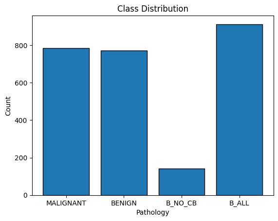
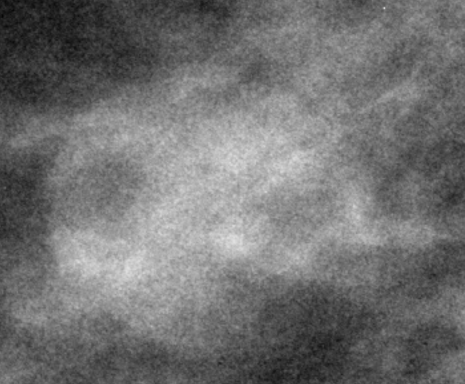
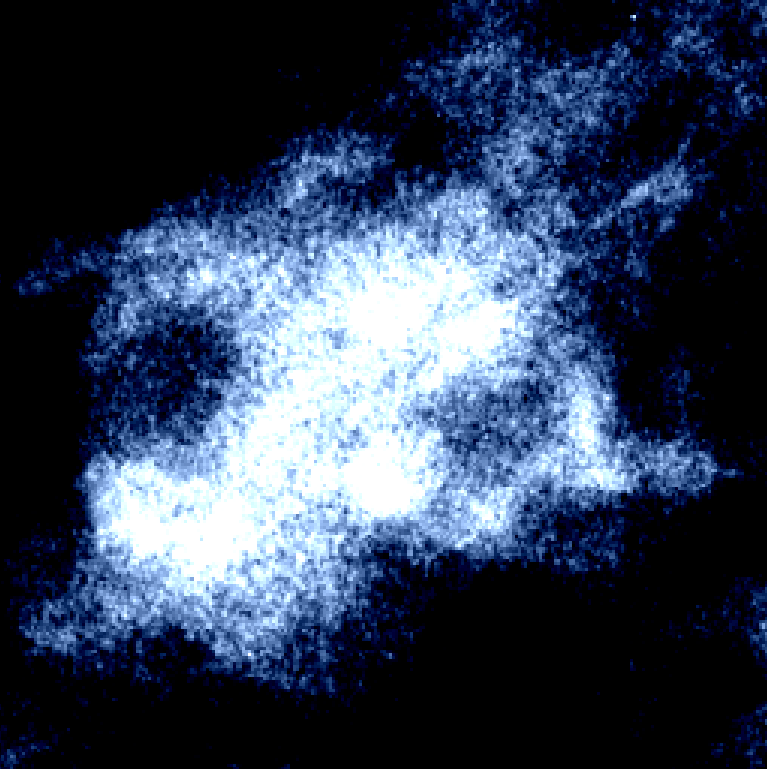
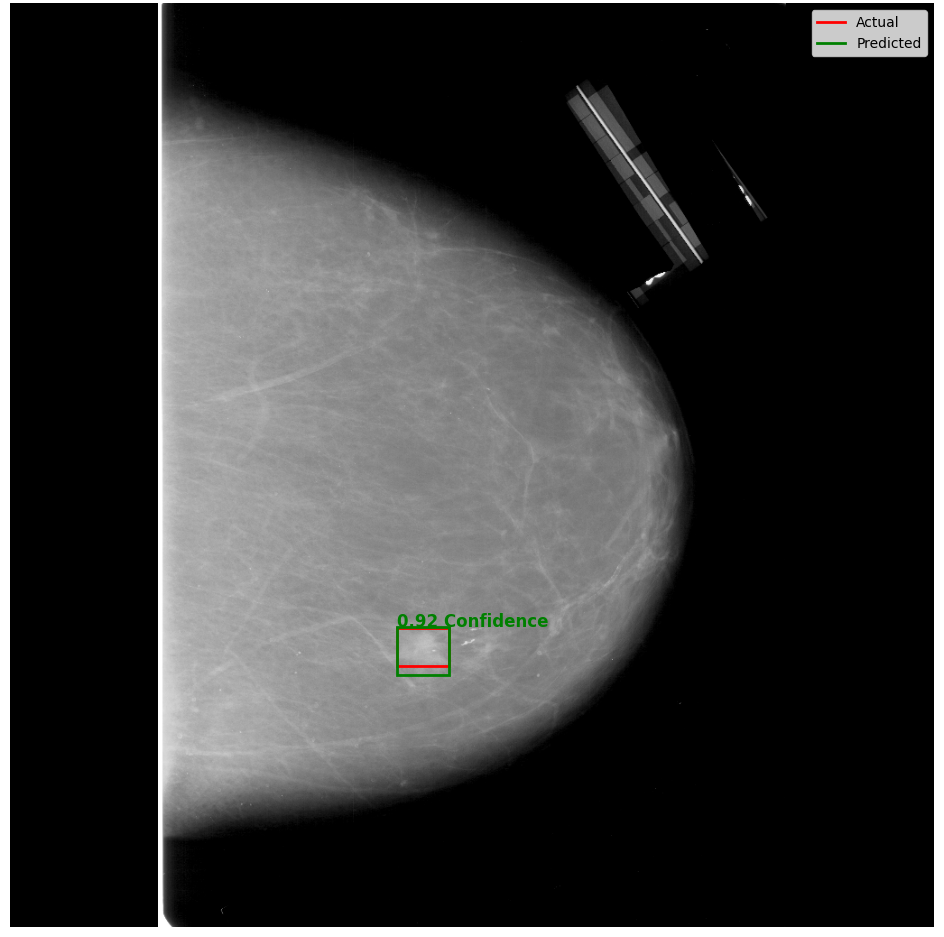
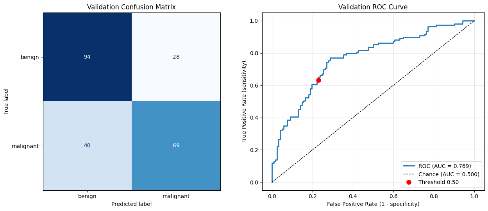
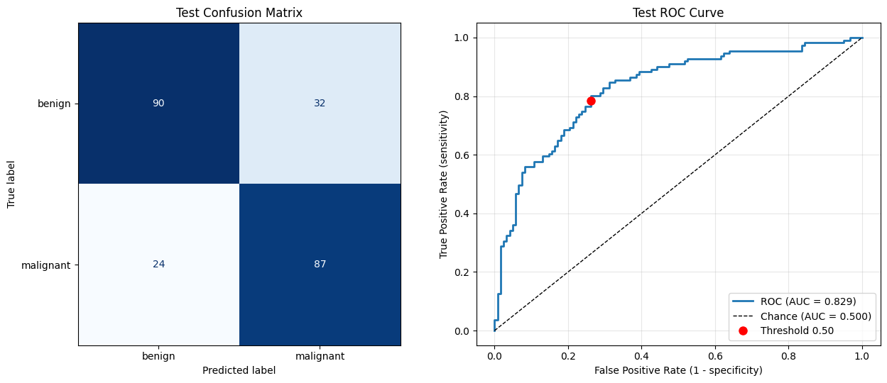

# Total Word Count: 7,790

---

# 1 Introduction (WC: 927)

## 1.1 Background: Breast Cancer and Detection Techniques

Breast cancer remains one of the most prevalent and globally impactful non-communicable diseases among females. According to the World Health Organization (WHO), there were an estimated 2.3 million new women diagnosed with breast cancer and 670,000 deaths globally in 2022 alone. The American Cancer Society further estimates that approximately 13% of women in the United States will develop breast cancer at some point in their lifetime[@acs_stats;@who]. Various risk factors contribute to its development, including age, family history, genetic mutations (such as BRCA1/BRCA2), and environmental factors.

Because breast cancer outcomes are heavily dependent on the stage at diagnosis, early and accurate detection combined with prompt treatment is paramount. When detected early and managed in well-resourced healthcare systems, the 5-year survival rate exceeds 90% [@acs_sr;@nci_breasts]. However, in low-to-middle-income countries where early screening is less accessible, mortality rates are disproportionately higher. This disparity highlights the critical global need for highly accurate, scalable, and accessible screening tools.

Currently, X-ray mammography is considered the "gold standard" for frontline breast cancer screening. It is a widely available, non-invasive imaging modality that uses low-dose X-rays to detect structural abnormalities [@wang_FO]. Radiologists typically classify these findings using the standardized BI-RADS (Breast Imaging Reporting and Data System) framework, looking for specific anomalies such as microcalcifications, architectural distortions, and masses (differentiating between benign, well-circumscribed masses and potentially malignant, spiculated ones).

Despite its widespread use, traditional mammography has notable clinical limitations. Most prominently, it exhibits reduced sensitivity (dropping to approximately 85% or lower) in women with dense breast tissue, as the dense glandular tissue appears white in the scan, the exact same color as potentially malignant tumors, thereby visually obscuring them. An example of this can be seen in @fig-mammograms. While alternative imaging techniques exist, such as Ultrasound (which avoids ionizing radiation and handles dense tissue better but is highly operator-dependent) and Magnetic Resonance Imaging (MRI) (which offers up to 95% sensitivity but is prohibitively expensive and largely inaccessible for routine screening), mammography remains the primary global screening tool [@wang_FO].

{#fig-mammograms fig-pos="H"}

## 1.2 Project Concept and Motivation

While mammography is indispensable, the manual interpretation of these medical images places a massive cognitive and visual load on radiologists. In a standard clinical setting, radiologists can perform up to 150+ screenings depending on the region, country, and hospital. This, combined with long (50+ hours per week), irregular work hours leads to severe fatigue and burnout [@ieong_worklod;@sunshine_work_hrs]. Because subtle malignancies can be incredibly difficult to differentiate from healthy dense tissue, this highly repetitive manual inspection is prone to human error and fatigue. Furthermore, it suffers from significant inter-observer variability, meaning different doctors might interpret the exact same scan differently depending on their experience level [@joshua_sd;@zhang_yolo].

Studies have shown that mammographic detection accuracy improves by 5–15% when scans are independently evaluated by a second radiologist [@chelpin_springer;@brem_ajr]. However, "double-reading" is not standard clinical practice globally due to severe shortages in specialized medical manpower and strict time constraints.

To bridge this gap, the medical field introduced Computer-Aided Diagnosis (CAD) systems. However, early generations of CAD relied on traditional machine learning and hand-crafted or statistically inferred features [@joshua_sd;@zhang_yolo]. These legacy systems were notorious for producing exceptionally high false-positive rates, which led to "alert fatigue," where the software flagged so many benign anomalies that it actually slowed radiologists down rather than assisting them.

This project is motivated by the need to overcome these legacy limitations by leveraging recent advancements in modern Artificial Intelligence (AI). Deep learning algorithms, specifically Convolutional Neural Networks (CNNs), represent a paradigm shift because they do not rely on human-engineered features; instead, they automatically learn complex, hierarchical, quantitative features directly from pixel data. This system is not intended to replace clinicians, but rather to act as a tireless, reliable "second opinion." By rapidly triaging images and automatically flagging potential malignancies with high precision, the model aims to minimize false negatives, reduce diagnostic bottlenecks, and assist healthcare professionals in making faster, data-driven decisions without succumbing to alert fatigue.

## 1.3 Project Aims

The primary aim of this project is to develop, train, and evaluate a robust deep learning computer vision pipeline capable of analyzing mammograms to automatically localize and classify breast tumors. To achieve this, the project is broken down into the following specific technical objectives:

* **Data Engineering:** Source, clean, and preprocess a recognized medical imaging benchmark dataset, specifically the CBIS-DDSM (Curated Breast Imaging Subset of DDSM).
* **Localization (Model 1):** Implement and train an object detection architecture, specifically a Faster R-CNN (Region-based Convolutional Neural Network), to accurately draw bounding boxes around Regions of Interest (ROIs) within the full mammogram scan.
* **Classification (Model 2):** Develop a secondary classification model (such as ResNet) that takes the localized crop from Model 1 and classifies the abnormality as either benign or malignant.
* **Clinical Safety Optimization:** Establish a rigorous evaluation framework using metrics appropriate for the medical domain (such as Mean Average Precision and F1-Score). Crucially, due to the high-stakes nature of cancer diagnosis, the system architecture and loss functions will be optimized to handle potential class imbalances and prioritize high Recall (Sensitivity). In a clinical context, a false negative (sending a sick patient home) is far more detrimental than a false positive (recommending a follow-up biopsy).

## 1.4 Project Template

In accordance with the module requirements, this project follows the “CM3015 Machine Learning and Neural Networks - Deep Learning Breast Cancer Detection” template. The applied methodology demonstrates an end-to-end machine learning pipeline, from data wrangling to multi-model orchestration, fulfilling the core learning outcomes of the brief.

# 2 Literature Review (WC: 1,325)

## 2.1 Introduction to the Literature Review

The application of computer science to medical imaging has undergone a paradigm shift over the last two decades. As the global incidence of breast cancer rises, researchers have continually sought ways to automate and optimize the screening process to assist radiologists. This literature review traces the evolution of these efforts, exploring the transition from traditional Computer-Aided Diagnosis (CAD) systems to modern Deep Learning architectures. Specifically, it examines the current state-of-the-art in Convolutional Neural Networks (CNNs), the role of Region-Based CNNs (like Faster R-CNN) in tumor localization, and the standardization of benchmarking via datasets such as the CBIS-DDSM. By analyzing recent academic advancements, this review identifies the gaps in current methodologies that this project aims to address.

## 2.2 The Evolution and Limitations of Traditional CAD Systems

Computer-Aided Diagnosis (CAD) systems were introduced to clinical workflows in the late 1990s and early 2000s to act as a "second pair of eyes" for radiologists. These traditional CAD models relied heavily on hand-crafted feature extraction. Engineers and medical professionals would mathematically define specific visual features, such as edge gradients, texture contrasts, and geometric shapes, which were then fed into traditional machine learning classifiers like Support Vector Machines (SVMs) or Random Forests [@liew_cancers;@joshua_sd].

While initially promising, longitudinal clinical studies revealed significant limitations in traditional CAD systems. The primary drawback was an unacceptably high false-positive rate. Because hand-crafted features struggle to capture the complex, highly variable nature of breast tissue (especially dense tissue), traditional CAD systems frequently flagged healthy glandular tissue as suspicious. A comprehensive retrospective study comparing traditional CAD to modern AI approaches demonstrated that traditional CAD systems generated an average of 3.24 false marks per non-cancerous exam, compared to just 0.91 for deep learning models [@bahl_2025]. This high false-positive rate led to "alert fatigue," where radiologists learned to ignore the CAD system entirely, or worse, ordered unnecessary and invasive biopsies that caused severe patient anxiety and financial strain [@joshua_sd;@saber_nature].

## 2.3 The Deep Learning Paradigm Shift in Mammography

To overcome the limitations of hand-crafted features, the medical imaging field pivoted toward Deep Learning (DL), specifically Convolutional Neural Networks (CNNs). Unlike traditional machine learning, CNNs automatically learn hierarchical feature representations directly from raw pixel data. Lower layers learn fundamental features like edges and curves, while deeper layers synthesize these into complex semantic representations of masses or microcalcifications.

Recent literature demonstrates that DL architectures significantly outperform traditional CAD in both sensitivity and specificity. For example, Shen et al. (2019) demonstrated that deep CNNs could achieve an accuracy matching, and in some cases exceeding, that of experienced radiologists when classifying mammograms. Furthermore, by utilizing Transfer Learning, where models pre-trained on massive generalized datasets like ImageNet are fine-tuned on medical images, researchers have mitigated the issue of data scarcity in the medical domain.

## 2.4 Localization Techniques: The Role of Region-Based CNNs (Faster R-CNN)

In clinical practice, merely classifying an entire mammogram as "malignant" or "benign" is insufficient; a CAD system must also provide spatial interpretability by localizing the exact position of the suspicious mass. Consequently, object detection frameworks have become a focal point of recent research.

The Faster R-CNN (Region-based Convolutional Neural Network) architecture has emerged as a highly effective tool for this task. Faster R-CNN utilizes a Region Proposal Network (RPN) that shares full-image convolutional features with the detection network, enabling nearly cost-free region proposals. Studies evaluating Faster R-CNN on mammograms have shown promising results. For instance, a recent study applying a modified Faster R-CNN to mammogram datasets achieved a Mean Average Precision (mAP) of over 90% in detecting bounding boxes around lesions [@zhang_ui]. The literature suggests that while single-stage detectors like YOLO are faster, two-stage detectors like Faster R-CNN often provide the rigorous precision required for high-stakes medical imaging, making it the ideal choice for the localization phase (Model 1) of this project's pipeline.

## 2.5 Classification via ResNet Architectures

Once a mass is localized, the next objective is classification. Deep residual networks, specifically ResNet (e.g., ResNet-50), are heavily favored in breast cancer literature due to their ability to mitigate the "vanishing gradient" problem through skip connections. This allows for the training of exceptionally deep networks capable of capturing the nuanced textures that differentiate a benign fibroadenoma from a malignant invasive ductal carcinoma.

In multiple recent studies evaluating various CNN backbones for breast cancer detection, ResNet-50 was identified as the optimal architecture, achieving an Area Under the Curve (AUC) of over 95% on benchmark datasets when coupled with different patch sampling techniques [@shen_nature;@rajendran]. This highlights the efficacy of combining a localization model to extract a "patch" or Region of Interest (ROI) and passing it to a ResNet backbone for final classification, the exact hierarchical approach adopted by this project.

## 2.6 Benchmark Datasets: The CBIS-DDSM Standard

A recurring theme in the literature is the vital importance of standardized datasets for training and evaluating DL models. Historically, the Digital Database for Screening Mammography (DDSM) was the primary resource. However, it suffered from outdated compression formats and imprecise region-of-interest annotations.

To resolve this, Lee et al. (2017) released the Curated Breast Imaging Subset of DDSM (CBIS-DDSM). This dataset includes updated ROI segmentations, bounding boxes, and verified pathological diagnoses (Benign, Benign without Callback, and Malignant) evaluated by trained mammographers. The literature overwhelmingly relies on CBIS-DDSM as a benchmark for proving model efficacy. By utilizing the CBIS-DDSM dataset, this project aligns itself with established academic standards, ensuring that the evaluation metrics generated are directly comparable to state-of-the-art research.

## 2.7 Comparative Analysis of Prior Work

### 2.7.1 The Efficacy and Clinical Challenges of Deep Learning in Mammography

In a recent comprehensive review, Wang (2024) explored the transformative potential of deep learning-assisted X-ray mammography for breast cancer screening. The study highlights that while traditional mammography is the standard, it struggles with sensitivity in patients with dense breast tissue. Wang (2024) demonstrates that the integration of deep learning algorithms significantly enhances diagnostic accuracy, allowing for the detection of subtle abnormalities that manual inspection might miss.

However, the paper also critically addresses the ongoing challenges of deploying these models in real-world clinical environments. These hurdles include the necessity for large, high-quality, labeled datasets to prevent model overfitting, as well as the overarching issue of model generalizability across diverse patient populations. Although the CBIS-DDSM dataset is exceptional for training breast cancer detection models, it is one of only a few high-quality datasets for such a task. This scarcity is mainly due to the difficulty of obtaining and properly labeling data.

Wang’s findings strongly support the architectural choices of this project, specifically the use of the curated CBIS-DDSM dataset to provide high-quality standardized training data, and the implementation of a rigorous evaluation framework designed to address the clinical generalizability concerns raised in the literature.

### 2.7.2 The Clinical Impact of Computer-Aided Detection on Radiologist Sensitivity

To understand the baseline necessity for automated localization and classification tools, it is crucial to examine how "second opinions" physically impact screening outcomes. Brem et al. (2003) conducted a foundational multi-institutional trial evaluating whether early Computer-Aided Detection (CAD) systems could successfully identify breast cancers that radiologists had previously missed. The study retrospectively analyzed 377 screening mammograms where cancer was present but was initially interpreted as normal or benign by clinicians.

The findings were striking: the calculated sensitivity of the radiologists without any computer assistance was only 75.4%. However, when the missed cases were evaluated using a CAD system, the estimated sensitivity of the radiologists rose to 91.4%, representing a 21.2% increase in overall radiologist sensitivity. Furthermore, the study noted that while having two independent radiologists double-read a mammogram improves detection by 5–15%, this manual process is highly resource-intensive. This validates the core premise of this project: an automated deep learning pipeline (like the proposed Faster R-CNN) does not need to be perfect on its own; by simply flagging missed anomalies as a tireless, automated "second reader," it has the potential to dramatically improve diagnostic accuracy without straining hospital manpower.

# 3 Design (WC: 1,985)

## 3.1 Project Overview and Template Identification

The objective of this project is to develop an automated computer vision pipeline capable of detecting and classifying breast cancer tumors in screening mammograms. By utilizing deep learning algorithms, the system aims to act as a reliable "second opinion" to assist radiologists in clinical diagnostics.

Once again, in accordance with module guidelines, this project follows the “CM3015 Machine Learning and Neural Networks - Deep Learning Breast Cancer Detection” template.

## 3.2 Domain and User Analysis

### 3.2.1 The Domain

The domain of this project is medical image analysis, specifically the automated detection and classification of breast cancer masses in X-ray mammography. Diagnosing breast cancer from mammograms is an inherently complex task due to the subtle variations in tissue density, the noisy background of healthy breast tissue, and the often ambiguous boundaries of lesions. Traditional CAD systems relied heavily on hand-crafted features, such as Gray Level Co-occurrence Matrix (GLCM) textures and morphological properties, passed into standard machine learning classifiers like SVMs. However, these traditional pipelines struggled to autonomously learn complex, high-level abstractions. Deep learning offers a modern alternative by autonomously learning hierarchical feature representations directly from the raw pixel data, significantly improving diagnostic potential.

### 3.2.2 Target Users and Personas

The target users for this system are medical professionals, primarily diagnostic radiologists. Radiologists often face immense time constraints, heavy case volumes, and the risk of visual fatigue, which can lead to inter-observer variability and missed diagnoses.

This system is not designed to replace radiologists, but rather to serve as an automated "second opinion" or clinical aid. By instantly highlighting suspicious regions and providing a probabilistic classification of malignancy, the system aims to triage high-risk patients, reduce the rate of false negatives, and ultimately streamline the clinical workflow.

## 3.3 Design Requirements and Justification

A key design requirement is addressing the historical limitations of Computer-Aided Diagnosis (CAD) systems, which traditionally suffered from excessively high false-positive rates. To justify its clinical utility, this system must not overwhelm the user with "alert fatigue."

Therefore, a single-model approach (passing the entire mammogram into one classifier) was rejected. Single models often struggle to isolate microscopic features (like microcalcifications) against the massive background of a high-resolution 4K mammogram. Instead, a hierarchical, two-stage "Crop and Classify" design is required. By forcing an object-detection model to explicitly isolate the Region of Interest (ROI) first, we dramatically reduce the background noise before the secondary classification model makes its final prediction.

## 3.4 Overall Structure and Architectural Pipeline

The project architecture is divided into a two-stage sequential pipeline:

1. **Stage 1:** Localization (Model 1): The system first ingests a scaled-down mammogram image. A Faster R-CNN (Region-based Convolutional Neural Network) is tasked with scanning the image to locate potential masses. It outputs a bounding box coordinate (x, y, width, height) and a confidence score. Faster R-CNN was chosen over single-stage detectors (like YOLO) because its Region Proposal Network (RPN) generally yields the higher precision required for ambiguous medical textures.
2. **Stage 2:** Classification (Model 2): The bounding box coordinates generated by Model 1 are used to programmatically crop the localized abnormality from the original scan. This much smaller, isolated patch is then fed into a deep Residual Network (ResNet-50). The ResNet model extracts deep semantic features to classify the crop into one of two clinical categories: Benign or Malignant.

## 3.5 Technologies Stack and Key Methods

To execute this architecture, the following technology stack was selected:

* **PyTorch & Torchvision:** The primary deep learning framework. Beyond PyTorch’s intuitive dynamic computational graph, it was explicitly chosen over TensorFlow due to its superior hardware compatibility in this project's development environment. Recent versions of TensorFlow have deprecated native GPU support for Windows, requiring complex WSL2 workarounds. PyTorch provides seamless, native CUDA acceleration on newer Windows builds, ensuring the local GPU can be fully utilized without environment overhead. Torchvision provides the pre-trained Faster R-CNN and ResNet backbones.
* **OpenCV (cv2):** Used extensively in the data preprocessing pipeline. Specifically, OpenCV’s contour detection algorithms are required to automatically translate the binary mask images provided in the dataset (stored as JPGs where the tumor is pure white against a pure black background) into strictly defined bounding-box coordinates for the Faster R-CNN training loop.
* **Albumentations:** Used to transform image data and bounding boxes for consistent inputs and overfitting prevention.

## 3.6 Data Management Strategy and Hardware Feasibility

### 3.6.1 Data Management

A major feasibility challenge in medical deep learning is data storage and hardware limitations. The raw CBIS-DDSM dataset hosted on The Cancer Imaging Archive (TCIA) exceeds 160 GB and uses obsolete, highly cumbersome DICOM compression formats.

To optimize the training pipeline, a data engineering workaround was implemented. The project utilizes a derivative dataset hosted on [Kaggle](https://www.kaggle.com/datasets/awsaf49/cbis-ddsm-breast-cancer-image-dataset). This version converted the raw scans into standard JPG formats while extracting the vital DICOM metadata into separate, easily parsed CSV files. According to the dataset documentation, this conversion maintains the same image quality and resolution as the original DICOM files. Crucially, this format translation reduced the total dataset footprint to a highly manageable 6.3 GB.

### 3.6.2 Justification for Local Hardware Execution Over Cloud Infrastructure {#local_specs}

While cloud-based machine learning environments like Google Colab are frequently utilized for academic projects, this system architecture explicitly avoids cloud dependency in favor of local hardware execution. The end-to-end pipeline is trained and evaluated entirely on an Alienware 16X Aurora AC16251 equipped with an Intel Core Ultra 9 275HX processor, 32 GB RAM, and an NVIDIA RTX 5070 GPU. This strategic engineering decision was driven by several severe limitations inherent to Google Colab’s free tier, which pose a direct risk to the feasibility of training a complex Faster R-CNN architecture.

First, evaluating the hardware specifications reveals a significant performance advantage locally. Google Colab’s free tier typically provides aging and heavily shared NVIDIA T4 GPUs with constrained RAM allocations. In contrast, the RTX 50-series graphics architecture provides vastly superior CUDA core counts and memory bandwidth, which accelerates the tensor calculations required for high-resolution medical imaging. Furthermore, Colab's compute allocation is highly dynamic and varied; access to GPUs or Tensor Processing Units (TPUs) is never guaranteed. During peak network times, the free tier aggressively throttles resource availability, which introduces unpredictable delays into the development cycle.

Second, deep learning workflows, particularly the iterative hyperparameter tuning required to optimize a two-stage object detection and classification pipeline, are highly time-intensive. Google Colab enforces a strict 12-hour maximum runtime limit on free instances, additionally terminating sessions even sooner due to idle timeouts or sudden resource reallocation. Training a Faster R-CNN model across a large number of epochs (potentially on Colab's free CPU) can easily exceed these limits, resulting in the loss of training progress mid-execution. Local execution entirely circumvents this constraint, allowing for uninterrupted, multi-day training loops.

Finally, data persistence and Input/Output (I/O) speeds were critical deciding factors. Virtual cloud instances are ephemeral; once a Google Colab session terminates, the virtual machine is wiped. Retaining the 6.3 GB CBIS-DDSM dataset between sessions would require integrating and mounting a personal Google Drive account. Not only does this risk exceeding the storage limits of a standard cloud drive, but reading thousands of high-resolution images across a network drive during PyTorch's `__getitem__` training loop creates a massive I/O bottleneck. By storing the dataset permanently on local solid-state storage, the PyTorch data loaders can operate at maximum read speeds, drastically reducing the overall epoch training time.

## 3.7 Testing and Evaluation Framework

Because the pipeline consists of two distinct models, the evaluation framework is bifurcated:

* **Localization Evaluation:** Model 1 is evaluated using Mean Average Precision (mAP) across varying Intersection over Union (IoU) thresholds. In medical imaging, drawing pixel-perfect boxes around fuzzy tumors is subjectively difficult even for human radiologists. Therefore, an mAP at an IoU of 0.50 (mAP_50) is considered the primary metric for successful region proposals.
* **Classification Evaluation:** Model 2 is evaluated on its ability to classify the tightly cropped ROIs. The evaluation framework emphasizes:

	* **Confusion Matrices:** To visually track the exact distribution of True Positives, True Negatives, False Positives, and False Negatives.
    
	- **Sensitivity / Recall:** The most critical metric for Model 2. The pipeline is heavily tuned and evaluated based on its ability to maximize the recall of the Malignant class (minimizing the number of malignant cases incorrectly predicted as benign).
    
	- **Receiver Operating Characteristic (ROC) and Area Under the Curve (AUC):** To evaluate the model's performance across all classification thresholds, allowing for future threshold adjustments to favor sensitivity in a clinical setting.

## 3.8 Project Work Plan and Timeline

To ensure the systematic execution of this two-stage hierarchical deep learning pipeline, a comprehensive work plan was developed. The project is structured into eight sequential—potentially overlapping—phases, tracking the progression from initial research to the final end-to-end system evaluation. Tables -@tbl-midterm_work and -@tbl-final_work show the estimated week-by-week timeline for the prototype and final products respectively. Note that weeks 11, 12, 21, and 22 are missing. These weeks are reserved for coursework from other modules.

**Phase 1: Literature Review and Research**

- **Objective:** Establish the clinical need and technical foundation for the proposed architecture.
- **Tasks:** Review existing academic literature regarding the limitations of traditional CAD systems, the impact of dense breast tissue on screening sensitivity, and state-of-the-art computer vision architectures (such as Region Proposal Networks and Convolutional Neural Networks) for medical imaging. This phase will continue throughout the entire project as more research may be needed at any time.

**Phase 2: Dataset Selection and Exploration**

- **Objective:** Secure, analyze, and map the primary data source.
- **Tasks:** Find a suitable, publicly available, and widely used dataset for the project. Conduct comprehensive data exploration to map clinical metadata to the mammography scans, analyze the class distribution (Malignant vs. Benign), and establish the feasibility of executing the training pipeline on local hardware vs. cloud-based environments.

**Phase 3: Data Cleaning and Preprocessing**

- **Objective:** Standardize the raw medical imagery for neural network ingestion.
- **Tasks:** Filter out microcalcification samples to isolate mass abnormalities and remove scans with corrupted or mismatched Region of Interest (ROI) dimensions. Implement the `albumentations` library to resize images, apply probabilistic spatial augmentations, and convert binary ROI masks into exact mathematical bounding box coordinates. Finally, partition the dataset into a strict 80–20 train-test split.

**Phase 4: Model 1 Design, Training, and Testing (Feature Prototype)**

- **Objective:** Develop and evaluate the tumor localization architecture.
- **Tasks:** Implement a Faster R-CNN model with a ResNet-50-FPN backbone using PyTorch. Train the network utilizing native CUDA acceleration to identify and draw bounding boxes around suspected masses. Evaluate the model's success using visual prediction overlays and Mean Average Precision (mAP) metrics, specifically prioritizing the mAP_50 threshold.

**Phase 5: Preliminary Report Compilation**

- **Objective:** Document the system design and prove the feasibility of the prototype.
- **Tasks:** Synthesize the literature review, architectural design, data exploration, and Model 1 test results into a formal academic preliminary report. Identify known architectural limitations and draft strict methodological solutions for the subsequent phases.

**Phase 6: Model 2 Design, Training, and Testing**

- **Objective:** Develop the secondary mass classification architecture.
- **Tasks:** Implement a ResNet-50 classifier designed to ingest the cropped anomalies generated by Model 1. Train the model using the pathology-verified ground-truth bounding boxes coupled with spatial "jitter" augmentations to simulate real-world inaccuracies. Apply a weighted loss function to ensure the model prioritizes clinical sensitivity (Recall).

**Phase 7: Full Pipeline Integration and Testing**

- **Objective:** Evaluate the end-to-end automated diagnostic system.
- **Tasks:** Integrate Model 1 and Model 2 into a single continuous inference script. Feed unseen mammograms into the pipeline to evaluate the automated cropping and classification process. Tune Model 1's confidence threshold to mitigate false positives and benchmark the overall system's accuracy against existing clinical standards.

**Phase 8: Final Report and Deliverables**

- **Objective:** Finalize all technical and academic documentation for final submission.
- **Tasks:** Compile the final testing metrics, clean and comment the final source code repository, and write the final comprehensive project report.

| Phase |      W1      |      W2      |      W3      |      W4      |      W5      |      W6      |      W7      |      W8      |      W9      |     W10      |
|:------|:------------:|:------------:|:------------:|:------------:|:------------:|:------------:|:------------:|:------------:|:------------:|:------------:|
| 1     | $\checkmark$ | $\checkmark$ | $\checkmark$ | $\checkmark$ | $\checkmark$ | $\checkmark$ | $\checkmark$ | $\checkmark$ | $\checkmark$ | $\checkmark$ |
| 2     |              | $\checkmark$ |              |              |              |              |              |              |              |              |
| 3     |              | $\checkmark$ | $\checkmark$ |              |              |              |              |              |              |              |
| 4     |              |              |              | $\checkmark$ | $\checkmark$ | $\checkmark$ | $\checkmark$ |              |              |              |
| 5     |              |              |              |              |              | $\checkmark$ | $\checkmark$ | $\checkmark$ | $\checkmark$ | $\checkmark$ |
: Prototype Timeline (Weeks 1–10) {#tbl-midterm_work tbl-pos="H"}

| Phase |     W13      |     W14      |     W15      |     W16      |     W17      |     W18      |     W19      |     W20      |     W23      |     W24      |
|:------|:------------:|:------------:|:------------:|:------------:|:------------:|:------------:|:------------:|:------------:|:------------:|:------------:|
| 1     | $\checkmark$ | $\checkmark$ | $\checkmark$ | $\checkmark$ | $\checkmark$ | $\checkmark$ | $\checkmark$ | $\checkmark$ | $\checkmark$ | $\checkmark$ |
| 2     | $\checkmark$ |              |              |              |              |              |              |              |              |              |
| 4     |              |              |              |              | $\checkmark$ | $\checkmark$ |              |              |              |              |
| 6     | $\checkmark$ | $\checkmark$ | $\checkmark$ | $\checkmark$ | $\checkmark$ | $\checkmark$ |              |              |              |              |
| 7     |              |              |              |              |              |              | $\checkmark$ | $\checkmark$ |              |              |
| 8     |              |              |              |              | $\checkmark$ | $\checkmark$ | $\checkmark$ | $\checkmark$ | $\checkmark$ | $\checkmark$ |
: Final Product Timeline (Weeks 13–22) {#tbl-final_work tbl-pos="H"}

# 4 Implementation (WC: 1,282)

## 4.1 Environment and Modularity

As outlined in the system architecture, this project utilizes a two-stage hierarchical deep learning pipeline. In order to ensure file readability, the pipeline is currently implemented across entirely distinct notebooks to enforce a clean separation of concerns:

1. **Data Exploration:** A dedicated notebook for exploring the dataset.
    
2. **Model 1 (Localization):** A dedicated notebook for training and evaluating the Faster R-CNN.
    
3. **Model 2 (Classification):** A dedicated notebook for training the ResNet-50.

Shared functions and mathematical evaluation metrics are abstracted into a central `util.py` script. Additionally, custom Dataset classes are delegated to a separate Python file. This extreme modularity prevents variable conflicts, manages memory efficiently, and allows each model to be trained and iterated upon independently before final pipeline integration.

## 4.2 Shared Functionalities

### 4.2.1 Image Preprocessing

For both Model 1 and Model 2, the `Albumentations` library is standardized as the core data processing and augmentation pipeline.

### 4.2.2 Optimizations

Given the intense computations associated with neural network training, executing standard training loops caused immediate memory bottlenecks. To implement a highly efficient training routine, PyTorch’s `GradScaler` (`torch.cuda.amp.GradScaler`) was implemented across both models.

This technique, known as Automatic Mixed Precision (AMP), allows the models to perform certain operations in 16-bit float (half precision) instead of standard 32-bit float. By wrapping the forward pass and loss calculation in `torch.autocast(device_type='cuda')`, the memory footprint is drastically reduced. The `GradScaler` then scales the loss before calling `.backward()` to prevent the gradients from "underflowing" (becoming zero). This shared implementation allowed for larger batch sizes and faster convergence times across the entire project without sacrificing architectural complexity.

## 4.3 Dataset Exploration

The first step of the project was establishing a robust, automated data pipeline. The kagglehub library was explicitly called to securely download the pre-processed 6.3 GB derivative of the CBIS-DDSM dataset directly to the local machine.

Upon extracting the data to the local `../../data/cbis-ddsm` directory, a significant data exploration phase was conducted. The Pandas library was utilized to parse and merge the clinical CSV metadata files, mapping each full-resolution mammogram to its corresponding bounding-box ROI mask(s) and pathological ground-truth labels (Benign vs. Malignant).

During this exploration, the class distribution of the masses was analyzed (see @fig-classes). The dataset categorizes tumors into Malignant, Benign, and 'Benign without callback' (B_NO_CB). To understand the overarching clinical challenge, the two benign classes were aggregated into a single B_ALL category. 

The dataset was found to contain 912 benign masses (53.8%) and 784 malignant masses (46.2%). While real-world clinical screening data suffers from extreme class imbalance, this specific dataset derivative is surprisingly well-balanced (a 1.16:1 ratio). Because of this near 50/50 distribution, the classification model (Model 2) is not at risk of majority-class collapse. Therefore, aggressive synthetic oversampling techniques like SMOTE or GANs are unnecessary.

{#fig-classes fig-pos="H"}

## 4.4 Data Cleaning and Splitting

During the initial data filtering phase, all microcalcification samples were explicitly removed from the dataset. This architectural decision was made to establish a baseline performance on the mass abnormalities. The calcification data will be re-integrated into the pipeline for the final product submission. Furthermore, a quality-control check was implemented for Model 1 to remove any samples where the binary ROI mask dimensions did not perfectly match the dimensions of the corresponding original mammogram. This step was critical to prevent severe spatial misalignment errors during the OpenCV bounding-box generation process.

Once the data was cleaned, it was divided using a standard 80–20 train-test split for Model 1, ensuring a robust and entirely unseen dataset for prototype evaluation. For Model 2, it was split into a 70-15-15 train-validation-test split. Since the dataset contains images with more than one ROI and multiple views for certain abnormalities, it was split using `PatientID` to explicitly prevent any potential data leakage.

## 4.5 Model 1

This stage utilizes a pre-trained Faster R-CNN architecture with a ResNet-50-FPN (Feature Pyramid Network) backbone, imported via PyTorch's `torchvision.models` module.

### 4.5.1 Dataset Structure

A custom PyTorch `Dataset` class was engineered to serve the Faster R-CNN. The most complex aspect of this implementation is the dynamic generation of bounding box target tensors. The Kaggle dataset stores the ground-truth ROIs as binary JPG masks (where the tumor is pure white and the background is pure black), as seen in @fig-ex_images. To train the Faster R-CNN, these visual must be mathematically converted into strict bounding box coordinates `[xmin, ymin, xmax, ymax]`. To achieve this, OpenCV (`cv2`) contour detection algorithms were integrated into the custom `__getitem__` function, demonstrated in [@lst-rcnn_get_item].

```{#lst-rcnn_get_item .python lst-cap="ROI-bounding box conversion" lst-pos="H"}
boxes = []
for r_path in roi_paths:
	# Read the mask
	mask = cv2.imread(r_path)
	pos = np.where(mask > 0)

	# Convert to bounding box format
	if len(pos[0]) > 0:
		xmin, xmax = np.min(pos[1]), np.max(pos[1])
		ymin, ymax = np.min(pos[0]), np.max(pos[0])
		boxes.append([xmin, ymin, xmax, ymax])

labels = [1] * len(boxes) if boxes else []

# Transform the image and bounding box(es)
transformed = self.transform(image=img, bboxes=boxes, labels=labels)
img_tensor = transformed['image']

# Transform box and label tensors into the proper type
if len(transformed['bboxes']) > 0:
	boxes = torch.as_tensor(transformed['bboxes'], dtype=torch.float32)
	labels = torch.as_tensor(transformed['labels'], dtype=torch.int64)
else:
	boxes = torch.empty((0, 4), dtype=torch.float32)
	labels = torch.empty((0,), dtype=torch.int64)
```

Using the machine described in Section [3.6.2](#local_specs) and taking advantage of PyTorch's mixed-precision training (`autocast`) resulted in a training time of just over 1 hour for 10 epochs ($\approx \frac{6.6 \text{ min}}{\text{epoch}}$).

::: {#fig-ex_images layout-ncol=2 fig-cap="Example images" fig-pos="H"}

{#fig-og_img width=70%}

{#fig-roi_mask width=70%}

:::

### 4.5.2 Image Augmentation

Before training and evaluation, the mammograms require structural preprocessing to meet the input tensor requirements of the neural network. As demonstrated in @lst-rcnn_transforms, the training and testing datasets have different augmentation pipelines:

```{#lst-rcnn_transforms .python lst-cap="Albumentations transformation pipeline for Model 1." lst-pos="H"}
train_transform = A.Compose(
    [
	    A.LongestMaxSize(1_024),
        A.PadIfNeeded(1_024, 1_024),
        A.HorizontalFlip(p=0.5),
        A.VerticalFlip(p=0.5),
        A.RandomBrightnessContrast(p=0.2),
        A.ToFloat(max_value=255.0),
        ToTensorV2()
    ],
    bbox_params=A.BboxParams(format='pascal_voc', label_fields=['labels'])
)
test_transform = A.Compose(
    [
	    A.LongestMaxSize(1_024),
        A.PadIfNeeded(1_024, 1_024),
        A.ToFloat(max_value=255.0),
        ToTensorV2()
    ],
    bbox_params=A.BboxParams(format='pascal_voc', label_fields=['labels'])
)
```

- **Training Transformations (`rcnn_train_transform`):** Medical images natively come in widely varying resolutions. To standardize them without distorting the anatomical shapes, the `LongestMaxSize` function is used to scale the longest edge of every image to exactly 1,024 pixels while preserving the original aspect ratio. The `PadIfNeeded` function then applies necessary black padding to force the image into a uniform 1,024x1,024 square. To artificially expand the dataset and improve the model's ability to generalize against overfitting, probabilistic data augmentations are applied. These include a 50% probability of horizontal and vertical flipping, alongside a 20% probability of random brightness and contrast adjustments. Finally, `ToFloat` normalizes the pixel values to a 0–1 scale, and `ToTensorV2` converts the matrix for PyTorch computation. Finally, the `BboxParams` argument dictates that whenever an image is resized, padded, or flipped, its corresponding ground-truth bounding box coordinates (using the `pascal_voc` format of `[xmin, ymin, xmax, ymax]`) are mathematically updated in perfect synchronization.
- **Testing Transformations (`rcnn_test_transform`):** The testing pipeline mirrors the structural resizing, padding, and normalization required to feed the 1,024x1,024 tensors into the model. However, it explicitly omits all probabilistic augmentations (flips and brightness shifts) to guarantee a strictly deterministic and reliable evaluation on the 20% test split.

## 4.6 Model 2

This stage utilizes a pre-trained ResNet-50 model, imported via PyTorch's `torchvision.models` module.

### 4.6.1 Dataset Structure

Another custom PyTorch `Dataset` was implemented specifically for Model 2. Unlike Model 1, this dataset class does not handle bounding box coordinates or custom cropping algorithms. For the current isolated testing phase, the system directly loads pre-cropped ROI images that are provided by the Kaggle dataset (demonstrated in @lst-resnet_get_item). This ensures the model is evaluated purely on its ability to classify the mass itself.

Establishing this baseline using the pre-cropped data is a vital intermediate step. As the project progresses towards integration, this implementation will be expanded. Future iterations will introduce a dedicated 'background' class and apply spatial jitter to the crops. At that stage, the dataset architecture will likely be modified to extend Model 1's dynamic bounding box logic.

```{#lst-resnet_get_item .python lst-cap="Model 2 getitem function" lst-pos="H"}
img_path = self.df.iloc[idx]['image_path']  
  
img = cv2.imread(img_path)  
img = cv2.cvtColor(img, cv2.COLOR_BGR2RGB)  
  
if self.transform:  
    transformed = self.transform(image=img)  
    img_tensor = transformed['image']  
else:  
    img_tensor = torch.from_numpy(img).permute(2, 0, 1).float() / 255.0  
  
pathology = self.df.iloc[idx]['pathology']  
label = 0 if pathology == 'BENIGN' else 1 
# At this point, pathology is either 'BENIGN' or 'MALIGNANT'  
  
return img_tensor, torch.tensor(label, dtype=torch.long)
```

Using the machine described in Section [3.6.2](#local_specs), training took no longer than 15 minutes.

### 4.6.2 Image Augmentation

Similar to Model 1, the cropped images require structural preprocessing to meet the input tensor requirements of the neural network. As demonstrated in @lst-resnet_transforms, the training and testing datasets have different augmentation pipelines:

```{#lst-resnet_transforms .python lst-cap="Albumentations transformation pipeline for Model 2." lst-pos="H"}
train_transform = A.Compose(
    [
	    A.Resize(256, 256),
        A.HorizontalFlip(p=0.5),
        A.VerticalFlip(p=0.5),
        A.RandomRotate90(p=0.5),
        A.RandomBrightnessContrast(p=0.5),
        A.Normalize(
            mean=[0.485, 0.456, 0.406],
            std=[0.229, 0.224, 0.225],
            max_pixel_value=255.0,
        ),
        ToTensorV2(),
    ])

test_transform = A.Compose(
    [
        A.Resize(256, 256),
        A.Normalize(
            mean=[0.485, 0.456, 0.406],
            std=[0.229, 0.224, 0.225],
            max_pixel_value=255.0,
        ),
        ToTensorV2(),
    ])
```

Despite both model transformation pipelines using the same augmentation strategies, they differ in their structural resizing approach: instead of using `LongestMaxSize` and `PadIfNeeded` to maintain the original aspect ratio, this transformation pipeline directly resizes images to 256x256. This augmentation is optimized for the pre-localized, cropped images where maintaining the original scale is less critical than achieving a uniform, computationally efficient input for final classification. Additionally, the `Normalize` function is used to normalize pixel values around specific values expected by the pre-trained ResNet model.

::: {#fig-cropped_images layout-ncol=2 fig-cap="Example Normalization" fig-pos="H"}

{#fig-og_cropped width=70%}

{#fig-normalized_cropped_img width=70%}

:::

# 5 Evaluation (WC: 1,693)

This chapter provides a comprehensive and critical evaluation of the deep learning pipeline developed for breast cancer detection, benchmarking the prototypes developed to date against the criteria established in the initial project proposal. It is essential to reiterate the context: as per the guidelines, this is a draft report, and the project is not expected to be complete at this stage. The pipeline currently exists as two effective, yet computationally isolated prototypes.

Therefore, this evaluation serves as a baseline analysis of the localized region-proposal system (Model 1) and the best-performing diagnostic classifier (Model 2). Critically, this chapter also analyzes the experimental failures and iteration history that informed the current prototypes, adhering to the requirement for a critical evaluation of "what worked and what did not work".

## 5.1 Model 1

Model 1 serves as the crucial first step in the CAD pipeline, learning to autonomously locate abnormalities within massive, full-screen mammograms and proposing bounding box regions to downstream systems. To evaluate its success, both quantitative metrics and qualitative visual inspections were employed.

* **Qualitative Visual Evaluation:** A custom `test_and_visualize` function was written using `matplotlib.patches` to overlay the model's predictions directly onto unseen test mammograms. Ground-truth bounding boxes were plotted in red, while the model's predicted bounding boxes (filtered by a confidence threshold) were plotted in green. Visual inspection of the prototype output confirms that the model is successfully ignoring healthy background tissue and actively identifying suspicious mass structures, demonstrating a functional Region Proposal Network (RPN). @fig-pred_vis demonstrates this achievement.
* **Quantitative Evaluation (mAP):** In object detection, Mean Average Precision (mAP) is the standard evaluation metric. The prototype achieved an mAP of 0.6392 at an Intersection over Union (IoU) threshold of 0.50 (mAP_50). While the strict mAP (evaluated across IoU thresholds of 0.50 to 0.95) was lower at 0.2731, this discrepancy is a recognized phenomenon in medical imaging. Tumor boundaries in mammograms are inherently fuzzy, ambiguous, and highly subjective—even expert radiologists rarely achieve a 90% bounding box overlap with one another. Therefore, achieving a strong mAP_50 score of nearly 64% proves that the model is highly effective at its primary objective: isolating the general region of the anomaly so that it can be cropped and passed to the next stage of the pipeline.

{#fig-pred_vis width=80% fig-pos="H"}

## 5.2 Model 2

Model 2’s exclusive clinical objective is to receive a tightly cropped ROI (provided statically by the dataset for this phase) and determine its malignancy: Benign (Class 0) or Malignant (Class 1).

### 5.2.1 Iterative Process

#### 5.2.1.1 Unfreezing layers

Early classification experiments were conducted by unfreezing several convolutional blocks of the ResNet-50 backbone pre-trained on ImageNet. The hypothesis was that unfreezing these weights would allow the network to fine-tune its low-level feature extraction filters for the specific textural nuances of mammographic masses.

This experiment resulted in severe overfitting. The training accuracy skyrocketed rapidly toward 100%, yet validation accuracy and recall remained low and highly volatile. Analysis concluded that because the available CBIS-DDSM cropped training set is relatively small and specialized, unfreezing the layers allowed the high-capacity network to simply memorize the pixel noise and specific artifact patterns of the training images, rather than learning general pathological features. This dictated the critical strategy shift implemented in the successful prototype: keeping the ImageNet backbone entirely frozen during training and forces the model to rely solely on the powerful, general feature maps learned from millions of distinct natural images, which proved sufficient for establishing a robust baseline.

#### 5.2.1.2 Class Weights and Data Splitting

Using different training configurations, such as class weights and data splitting methods resulted in significant volatility in evaluation metrics. Early experiments using subpar loss calculations or standard random splitting (which risks data leakage by splitting patient IDs across sets) led to misleadingly high performance in some areas while showing total failure in others.

For example, one early configuration achieved a strong malignant recall of 0.94 but a disastrous benign recall of 0.33. This model was useless for cancer detection, as it effectively classified almost every patch as malignant, leading to a low number of false negatives but a high number of false positives. Other experiments yielded balanced but weak scores. Analyzing these failures was vital for configuring the optimal configuration setup and the current dataset splitting methodology (by `PatientID`), which ultimately enabled the development of the robust best-performing model.

### 5.2.2 Best Performing ResNet Model

The best baseline ResNet model to-date achieved the following metrics against the validation and test datasets:

::: {#fig-resnet-metrics layout-ncol=1 fig-cap="ResNet Performance Metrics" fig-pos="H"}

{#fig-val_metrics width=90%}

{#fig-test_metrics width=90%}

:::

**Validation Results:**

- During validation, the model achieved a Validation Loss of 0.6191 and a Validation Accuracy of 0.7056.
    
- The ROC-AUC score for the validation set was 0.7686.
    
- For the malignant classification, the precision was 0.71 and the recall (sensitivity) was 0.63, resulting in 40 false negative predictions.

**Test Results:**

- Performance noticeably improved on the unseen test dataset, achieving a Test Loss of 0.5302 and a Test Accuracy of 0.7597.
    
- The test ROC-AUC improved significantly to 0.8285.
    
- Test precision for the malignant class rose to 0.73, and test recall (sensitivity) rose to 0.78, with only 24 false negative predictions.

#### Analysis

Out of 109 actual malignant cases in the validation set, the model correctly identified 69 (True Positives) but missed 40 (False Negatives), classifying actual cancer cases as benign. This results in a malignant recall of 0.633.

This specific metric highlights a dangerous vulnerability in medical AI. Missing **36.6%** of cancers in the validation set is clinically unacceptable, even for a localized baseline. This critical analysis immediately points to the next operational phase: the model requires aggressive threshold tuning and the introduction of advanced data augmentations to shift its objective function toward maximizing malignant recall, even if it degrades overall accuracy by increasing benign false positives.

However, the model's performance improved when executed on the unseen test dataset. While counter-intuitive (as test metrics are usually slightly lower than validation), this demonstrates excellent generalization from the balanced training routine.

The significant jump in ROC-AUC from 0.7686 (Validation) to 0.8285 (Test) indicates the pre-trained ResNet model successfully learned general diagnostic feature representations. The test malignant recall of 0.78 (78% sensitivity) means the model missed 24 out of 111 test cases. This establishes the strong baseline requested in the proposal, proving that the technical pipeline is sound and the microservice approach is valid, even while substantial tuning is required for clinical safety.

## 5.3 Critical Evaluation and Future Improvements

### 5.3.1 Achievements to Date: 

The project has successfully demonstrated the feasibility of a modular, two-stage deep learning pipeline. By separating background filtration (Model 1) from diagnostic classification (Model 2), the system effectively mimics the cognitive workflow of a radiologist. The mAP_50 of 0.6392 for Model 1 and the ROC-AUC of 0.8285 for Model 2 establish a strong predictive baseline for identifying cancer in mammography.

### 5.3.2 Areas for Improvement:

As stated above, in medical diagnostic AI, false negatives are significantly more dangerous than false positives. While the test metrics improved, the validation phase highlighted a vulnerability with 40 false negatives. Moving forward, the project could be improved by:

1. Adjusting the prediction probability threshold to heavily favor sensitivity (recall) over precision, effectively reducing false negatives at the cost of flagging more benign masses for manual review.
    
2. Exploring weighted loss functions (penalizing missed malignancies more heavily) or advanced data augmentation strategies to improve robustness.

## 5.4 Work Still to Be Done

While the current results establish a solid, functional baseline for both localized region proposal and subsequent diagnostic classification, significant implementation and evaluation tasks remain to transition these isolated prototypes into a robust, integrated clinical aid. The immediate future work is structured across three main fronts: pipeline integration, data expansion, and model optimization.

### 5.4.1 Pipeline Integration and Dynamic Inference

The most critical remaining engineering task is the logical and computational integration of the two model prototypes into a singular, sequential inference pipeline. Currently, Model 1 and Model 2 operate in isolation within separate execution environments.

- **Merged Execution:** A unified script must be developed where the output tensor from Model 1 (the bounding box coordinates) dynamically triggers the cropping and preprocessing operations of the input matrix for Model 2.
    
- **End-to-End Evaluation:** The integrated system must be evaluated on full, unseen mammograms to compute the complete pipeline’s sensitivity and specificity, moving beyond the isolated model-level metrics achieved to date.

### 5.4.2 Data Expansion and Comprehensiveness

To simplify the development of the primary prototypes, the data pipeline was restricted to the analysis of breast masses. To ensure clinical utility, the scope must be expanded:

- **Reintegration of Calcification Datapoints:** The microcalcification subset of the CBIS-DDSM dataset, which was filtered out in the early prototype phase, must be reintroduced. This requires updating the data ingestion logic and retraining both Model 1 (to detect a second distinct abnormality class) and Model 2 (to classify the malignant potential of calcification clusters).

### 5.4.3 Model Optimization and Robustness

The validation phase of Model 2 identified specific vulnerabilities, notably the high incidence of false negatives (40 out of 109 malignant cases). Several mathematical and architectural improvements are scheduled:

1. **Implementing k-Fold Cross-Validation:** The current evaluation relies on a single validation/test split. A k-fold cross-validation strategy will be integrated into the central `util.py` training utility to provide a statistically robust estimate of model performance and prevent potential overfitting to a unique data subset.
    
2. **Introduction of a 'Background' Class:** Model 2 must be retrained with a dedicated third class (0: Background, 1: Benign, 2: Malignant). This implementation is essential for final pipeline integration, ensuring that if Model 1 generates a false proposal that contains only healthy tissue, the downstream classifier can correctly identify the error rather than forcing a diagnostic classification.
    
3. **Applying Spatial Jitter:** To make the classification model invariant to slight misalignments in region proposals, "spatial jitter" will be introduced into the Albumentations augmentation pipeline, generating random geometric offsets in the training crops.
    
4. **Threshold Tuning and Weighted Loss:** The high number of false negatives indicates the need to prioritize recall of the Malignant class. Future work will investigate adjusting the decision threshold or employing weighted loss functions to penalize missed malignancies more heavily, aligning the model with clinical requirements for high-sensitivity diagnostic aids.

# 6 Conclusion (WC: 578)

The primary goal of this project was to develop and evaluate a deep learning-based CAD system for the automatic identification of potential breast masses in digital mammograms. This effort aimed to contribute to the overarching goal of improving the accuracy and efficiency of early breast cancer diagnosis, which is crucial for reducing mortality rates. The project successfully navigated the inherent challenges of working with medical image data, demonstrating the potential of deep learning techniques, such as convolutional neural networks (CNNs), for this task.

Significant progress has been made through a methodical approach involving rigorous data cleaning and preprocessing of the CBIS-DDSM dataset, coupled with the standardized deployment of the Albumentations library across all processing phases to help combat overfitting on the relatively small dataset.

The successful implementation of a modular, sequential architecture was fundamental to the achieved performance. The first stage utilized a Faster R-CNN framework with a ResNet-50-FPN backbone, demonstrating strong effectiveness at accurately localizing potential masses (achieving an mAP_50 of 0.6392) within full-resolution mammograms. The second stage established a solid classification baseline using a ResNet-50 architecture trained on isolated ROI crops, achieving a strong final test ROC-AUC of 0.8285. While certain hyperparameter tuning strategies (specifically unfreezing layers during pre-training) led to overfitting, establishing this baseline performance using static data is a vital intermediate step for future development.

The significance of this work lies in its potential to serve as a robust clinical tool that can provide a "second opinion" to radiologists, thereby helping to reduce false negatives and improve overall diagnostic accuracy. While still in a developmental phase, this project contributes to the advancement of deep learning applications in healthcare, offering clear directions for future research.

However, several limitations were identified during the course of this project:

- **Detection of Small and Ambiguous Objects:** This remains a significant challenge, as the models struggled with detecting very small masses or those with subtle, ambiguous features.
    
- **Data Availability and Diversity:** While the CBIS-DDSM dataset is a valuable resource, model robustness and generalizability would benefit from validation on more large and diverse datasets.
    
- **Focus on a Single Modality:** The project was limited to X-ray mammograms and did not incorporate other promising imaging modalities like ultrasound or MRI.
    
Building on these insights, future work will focus on:

1. **Data Expansion and Comprehensiveness:** Reintegrating the filtered microcalcification data subset and refactoring the pipeline to simultaneously detect and classify multiple types of pathological structures.

2. **Optimization for Sensitivity and Robustness:** Exploring threshold tuning to favor recall over precision, implementing k-fold cross-validation, applying spatial jitter to training crops, and introducing a dedicated "Background" class to Model 2 to correct Model 1 region proposal errors, thereby reducing dangerous false negatives.
    
3. **Developing a Unified Framework:** Future efforts will seek to integrate mass detection, segmentation, and classification into a single, cohesive framework to provide a more comprehensive diagnostic output.
    
4. **Increasing Data Diversity and Modalities:** Investigation into incorporating other datasets and multi-modal image data to enhance generalizability.
    
5. **Focusing on User Interface and Deployment:** Design of a user-friendly system to integrate into a radiologist's workflow.
    
In conclusion, this project provides a solid foundation and demonstrates considerable promise for deploying a modular deep learning approach to automated breast mass detection and classification. By systematically addressing the current limitations and moving toward pipeline integration and data comprehensiveness, this research offers clear directions for developing an invaluable tool to support medical professionals in early cancer diagnosis and improve patient outcomes.



# 7 References