---

# Total Word Count: 9,403

---

# 1 Introduction (WC: 884)

## 1.1 Background: Breast Cancer and Detection Techniques

Breast cancer remains one of the most prevalent and globally impactful non-communicable diseases among females. According to the World Health Organization (WHO), there were an estimated 2.3 million new women diagnosed with breast cancer and 670,000 deaths globally in 2022 alone. The American Cancer Society further estimates that approximately 13% of women in the United States will develop breast cancer at some point in their lifetime[@acs_stats;@who]. Various risk factors contribute to its development, including age, family history, genetic mutations (such as BRCA1/BRCA2), and environmental factors.

Because breast cancer outcomes are heavily dependent on the stage at diagnosis, early and accurate detection combined with prompt treatment is paramount. When detected early and managed in well-resourced healthcare systems, the 5-year survival rate exceeds 90% [@acs_sr;@nci_breasts]. However, in low-to-middle-income countries where early screening is less accessible, mortality rates are disproportionately higher. This disparity highlights the critical global need for highly accurate, scalable, and accessible screening tools.

Currently, X-ray mammography is considered the "gold standard" for frontline breast cancer screening. It is a widely available, non-invasive imaging modality that uses low-dose X-rays to detect structural abnormalities [@wang_FO]. Radiologists typically classify these findings using the standardized BI-RADS (Breast Imaging Reporting and Data System) framework, looking for specific anomalies such as microcalcifications, architectural distortions, and masses (differentiating between benign, well-circumscribed masses and potentially malignant, spiculated ones).

Despite its widespread use, traditional mammography has notable clinical limitations. Most prominently, it exhibits reduced sensitivity (dropping to approximately 85% or lower) in women with dense breast tissue, as the dense glandular tissue appears white in the scan, the exact same color as potentially malignant tumors, thereby visually obscuring them. An example of this can be seen in @fig-mammograms. While alternative imaging techniques exist, such as Ultrasound (which avoids ionizing radiation and handles dense tissue better but is highly operator-dependent) and Magnetic Resonance Imaging (MRI) (which offers up to 95% sensitivity but is prohibitively expensive and largely inaccessible for routine screening), mammography remains the primary global screening tool [@wang_FO].

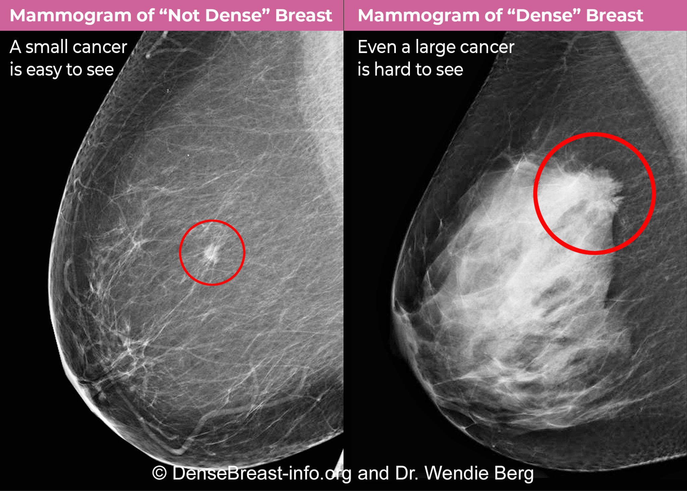{#fig-mammograms fig-pos="H"}

## 1.2 Project Concept and Motivation

While mammography is indispensable, the manual interpretation of these medical images places a massive cognitive and visual load on radiologists. In a standard clinical setting, radiologists can perform up to 150+ screenings depending on the region, country, and hospital. This, combined with long (50+ hours per week), irregular work hours leads to severe fatigue and burnout [@ieong_worklod;@sunshine_work_hrs]. Because subtle malignancies can be incredibly difficult to differentiate from healthy dense tissue, this highly repetitive manual inspection is prone to human error and fatigue. Furthermore, it suffers from significant inter-observer variability, meaning different doctors might interpret the exact same scan differently depending on their experience level [@joshua_sd;@zhang_yolo].

Studies have shown that mammographic detection accuracy improves by 5–15% when scans are independently evaluated by a second radiologist [@chelpin_springer;@brem_ajr]. However, "double-reading" is not standard clinical practice globally due to severe shortages in specialized medical manpower and strict time constraints.

To bridge this gap, the medical field introduced Computer-Aided Detection (CAD) systems. However, early generations of CAD relied on traditional machine learning and hand-crafted or statistically inferred features [@joshua_sd;@zhang_yolo]. These legacy systems were notorious for producing exceptionally high false-positive rates, which led to "alert fatigue," where the software flagged so many benign anomalies that it actually slowed radiologists down rather than assisting them.

This project is motivated by the need to overcome these legacy limitations by leveraging recent advancements in modern Artificial Intelligence (AI). Deep learning algorithms, specifically Convolutional Neural Networks (CNNs), represent a paradigm shift because they do not rely on human-engineered features; instead, they automatically learn complex, hierarchical, quantitative features directly from pixel data. This system is not intended to replace clinicians, but rather to act as a tireless, reliable "second opinion." By rapidly triaging images and automatically flagging potential malignancies with high precision, the model aims to minimize false negatives, reduce diagnostic bottlenecks, and assist healthcare professionals in making faster, data-driven decisions without succumbing to alert fatigue.

## 1.3 Project Aims {#aims}

The primary aim of this project is to develop, train, and evaluate a robust deep learning computer vision pipeline capable of analyzing mammograms to automatically localize and classify breast tumors. To achieve this, the project is broken down into the following specific technical objectives:

* **Data Engineering:** Source, clean, and preprocess a recognized medical imaging benchmark dataset, specifically the CBIS-DDSM (Curated Breast Imaging Subset of DDSM).

* **Localization (Model 1):** Implement and train an object detection architecture, specifically a Faster R-CNN (Region-based Convolutional Neural Network), to accurately draw bounding boxes around Regions of Interest (ROIs) within the full mammogram scan.

* **Classification (Model 2):** Develop a secondary classification model, specifically a ResNet-50 model, that takes the localized crop from Model 1 and classifies the abnormality as either benign or malignant.

* **Clinical Safety Optimization:** Establish a rigorous evaluation framework using metrics appropriate for the medical domain (such as Mean Average Precision and F1-Score). Crucially, due to the high-stakes nature of cancer diagnosis, the system architecture and loss functions will be optimized to handle potential class imbalances and prioritize high Recall (Sensitivity). In a clinical context, a false negative (sending a sick patient home) is far more detrimental than a false positive (recommending a follow-up biopsy).

## 1.4 Project Template

In accordance with the module requirements, this project follows the “CM3015 Machine Learning and Neural Networks - Deep Learning Breast Cancer Detection” template. The applied methodology demonstrates an end-to-end machine learning pipeline, from data wrangling to multi-model orchestration, fulfilling the core learning outcomes of the brief.

# 2 Literature Review (WC: 1,457)

## 2.1 Introduction and Theoretical Context

The integration of artificial intelligence into medical image analysis represents a critical evolution in modern healthcare. Breast cancer remains a leading cause of cancer mortality among women globally, with clinical outcomes heavily dictated by the timeliness and precision of diagnosis [@who;@acs_stats]. Although digital mammography serves as the primary screening tool worldwide, the visual interpretation of mammographic scans is constrained by human perceptual limitations, reader fatigue, and substantial inter-observer variability [@ieong_worklod;@brem_ajr]. Early automated screening tools attempted to mitigate these constraints through rule-based and shallow machine learning CAD systems. However, contemporary deep learning architectures have superseded traditional paradigms by autonomously learning hierarchical representations directly from pixel arrays.

This literature review provides a critical synthesis of the theoretical foundations, competing algorithmic paradigms, and clinical translation challenges in deep learning-assisted mammography. Rather than merely validating existing implementation choices, this review interrogates competing object detection frameworks (two-stage versus single-stage and transformer-based detectors), contrasts whole-image classification against cascaded patch-based architectures, and examines why exceptional benchmark metrics frequently fail to generalize to prospective clinical practice.

## 2.2 The Evolution and Clinical Failures of Traditional CAD

CAD systems entered clinical workflows following FDA approval in the late 1990s, intending to act as an asynchronous "second reader" to elevate screening sensitivity [@fujita]. Early CAD architectures relied on hand-crafted feature engineering pipelines, extracting low-level mathematical descriptors such as Gray Level Co-occurrence Matrix (GLCM) texture statistics, morphological eccentricity, and circular gradient spiculation vectors, which were subsequently classified using linear Support Vector Machines (SVMs) or shallow neural networks [@liew_cancers;@joshua_sd].

Despite initial commercial adoption, extensive longitudinal studies revealed that traditional CAD provided negligible clinical utility while incurring significant systemic costs. The fundamental flaw of hand-crafted systems was their inability to decouple pathological soft-tissue masses from normal overlapping fibroglandular parenchyma. Consequently, legacy CAD models produced an unacceptably high false-positive rate, averaging $3.24$ false marks per non-cancerous mammographic exam [@bahl_2025]. This high false-alarm density induced severe alert fatigue among interpreting radiologists, who either habituated to disregarding system prompts or were prompted into ordering unnecessary follow-up diagnostic workups, repeat imaging, and invasive biopsies for benign variations [@joshua_sd;@saber_nature]. From a utilitarian standpoint, the aggregate diagnostic yield was outweighed by patient anxiety, radiation burden, and escalating healthcare expenditures, demonstrating that high sensitivity is clinically counterproductive when unaccompanied by rigorous false-positive suppression.

## 2.3 Competing Detection Architectures: Two-Stage, Single-Stage, and Transformers

Modern deep learning methods have replaced hand-engineered heuristics with end-to-end differentiable neural networks. In mammographic abnormality localization, selecting an appropriate object detection paradigm requires balancing localization precision, multi-scale feature retention, and computational latency.

### 2.3.1 Two-Stage Object Detectors (Faster R-CNN)
Two-stage detectors decouple the localization pipeline into candidate region generation followed by region-level classification and bounding-box regression [@zhang_ui]. The Faster R-CNN framework accomplishes this via a shared convolutional backbone, typically equipped with a Feature Pyramid Network (FPN), and a dedicated Region Proposal Network (RPN). The RPN applies dense anchor boxes across multiple spatial pyramid levels, estimating "objectness" scores and initial coordinate offsets to generate a sparse set of candidate proposals (e.g., 1,000–2,000 RoIs). These proposals undergo Region of Interest (RoI) pooling (or RoIAlign) to extract fixed-size feature representations before being routed to task-specific fully connected heads for category classification and coordinate refinement.

The principal advantage of two-stage architectures in mammography lies in their sensitivity to low-contrast, ill-defined soft-tissue lesions embedded in dense parenchyma. By isolating region proposals from the background before final feature aggregation, Faster R-CNN maintains high feature-level resolution and avoids class-imbalance degradation caused by vast tracts of negative background tissue. However, two-stage detectors suffer from higher inference latency and memory footprints during training, rendering them less suitable for real-time edge processing.

### 2.3.2 Single-Stage Object Detectors (YOLO and RetinaNet)
Single-stage architectures, including the "You Only Look Once" (YOLO) family and RetinaNet, formulate object detection as a dense regression problem across a predetermined spatial grid, predicting bounding boxes and class probabilities in a single forward pass [@zhang_yolo]. Single-stage detectors achieve high inference throughput (often >30 FPS on consumer hardware), making them attractive for high-volume enterprise pipelines.

However, single-stage detectors present distinct theoretical vulnerabilities when applied to mammography:

1. **Extreme Foreground-Background Class Imbalance:** Because single-stage detectors evaluate tens of thousands of candidate grid cells simultaneously across the full image, dense negative background parenchyma heavily dominates the loss landscape. While focal loss (introduced in RetinaNet) dynamically down-weights easily classified background examples, subtle spiculation margins and faint soft-tissue lesions still suffer from reduced gradient signal compared to explicit two-stage proposal filtering.

2. **Coarse Spatial Feature Resolution:** Standard single-stage grid divisions aggregate visual features across relatively large receptive fields. For small focal abnormalities or punctate microcalcifications spanning only a few millimeters, spatial pooling in single-stage backbones can blend lesion features with surrounding glandular tissue, leading to elevated false-negative rates on subtle early-stage malignancies.

### 2.3.3 Transformer-Based Detectors (DETR and Deformable DETR)
Recent computer vision literature has introduced transformer-based object detection frameworks, such as DEtection TRansformer (DETR), which model object detection as a direct set-prediction problem using bipartite matching and multi-head self-attention mechanisms. DETR eliminates hand-designed components like anchor generation and non-maximum suppression (NMS), capturing long-range global contextual relationships across the entire breast volume.

Despite their theoretical elegance, transformers present substantial drawbacks for screening mammography:

- **Excessive Data and Pre-training Requirements:** Vision transformers lack the inductive biases (translation equivariance and spatial locality) inherent to convolutional networks. Consequently, they require massive pre-training corpora to learn effective representations, making them prone to severe overfitting on standard medical datasets like CBIS-DDSM, where sample sizes are limited to a few thousand scans.

- **Computational Scaling on High-Resolution Scans:** Self-attention computes quadratic complexity $\mathcal{O}(N^2)$ relative to sequence length. Processing full mammograms at high resolutions (e.g., $\ge 1024 \times 1024$) without downsampling creates prohibitive GPU memory overhead unless complex sparse-attention approximations are introduced.

| Architectural Paradigm                          | **Two-Stage Detectors**                                                                                       | **Single-Stage Detectors**                                                                                  | **Vision Transformers**                                                                                             |
| ----------------------------------------------- | ------------------------------------------------------------------------------------------------------------- | ----------------------------------------------------------------------------------------------------------- | ------------------------------------------------------------------------------------------------------------------- |
| Key Exemplars                                   | Faster R-CNN, Mask R-CNN                                                                                      | YOLO (v5–v8), RetinaNet                                                                                     | DETR, Deformable DETR                                                                                               |
|                                                 | &nbsp;                                                                                                        |                                                                                                             |                                                                                                                     |
| Primary Strengths in Mammography                | High recall on low-contrast lesions; explicit RoIAlign preserves boundary texture; robust proposal filtering. | Real-time inference speed; unified loss optimization; streamlined deployment pipeline.                      | Global contextual modeling across full breast field; eliminates heuristic anchor boxes and NMS.                     |
|                                                 | &nbsp;                                                                                                        |                                                                                                             |                                                                                                                     |
| Critical Limitations & Clinical Vulnerabilities | Increased training/inference computational overhead; multi-stage hyperparameter complexity.                   | Susceptible to extreme background imbalance; lower localization sensitivity on subtle, small-scale lesions. | High data-greediness; quadratic memory complexity on high-resolution inputs; risk of overfitting on modest cohorts. |
: Critical Comparison of Competing Object Detection Paradigms in Screening Mammography {#tbl-lit-detectors tbl-pos="H"}

## 2.4 Structural Paradigms: Patch-Based Classifiers vs. Cascaded Architectures

Beyond object detection, literature in medical image analysis diverges significantly regarding the optimal structural pipeline for mammographic diagnosis:

### 2.4.1 Full-Image Classifiers
Several prominent studies advocate for end-to-end classification models that process the full mammogram directly to output a single study-level malignancy probability. While computationally straightforward, full-image classifiers encounter a severe spatial dilemma: raw digital mammograms typically span $3000 \times 4000$ pixels at $50\text{–}100\,\mu\text{m}$ spatial resolution. Ingestion into standard CNN backbones requires aggressive downsampling (e.g., to $512 \times 512$ or $1024 \times 1024$), which irreversibly destroys high-frequency morphological details, such as subtle architectural distortions and microcalcification clusters. Furthermore, full-image classifiers act as "black boxes," offering poor spatial interpretability unless post-hoc attribution methods (e.g., Grad-CAM) are applied, which are notoriously imprecise for clinical decision verification.

### 2.4.2 Patch-Based Standalone Classifiers
Conversely, patch-based approaches train deep classification networks (e.g., ResNet, DenseNet, EfficientNet) exclusively on tightly cropped regions of interest extracted from ground-truth annotations [@shen_nature;@rajendran]. These models retain maximum spatial fidelity and focus gradient updates exclusively on lesion textures. However, standalone patch classifiers operate under the unrealistic clinical assumption that a perfect, noise-free bounding box is provided by an expert radiologist, completely ignoring the localization phase required in real-world screening workflows.

### 2.4.3 Cascaded "Detect-then-Classify" Hierarchies
To bridge this gap, modern CAD pipelines adopt a cascaded, multi-stage architecture. A wide-field localization model (Stage 1) scans the full-resolution mammogram to identify suspicious candidate regions, dynamically extracting these candidates as high-resolution sub-volumes for a specialized secondary classifier (Stage 2). This hierarchical decoupling achieves the dual benefits of full-field spatial scanning and uncompromised local morphological resolution. However, cascaded pipelines introduce a major engineering vulnerability: error propagation. False-positive proposals generated by Stage 1 are directly forwarded to Stage 2, which will misclassify normal parenchymal tissue as malignant unless explicitly engineered with false-alarm rejection mechanisms (such as a dedicated background class).

## 2.5 The Clinical Translation Gap: Benchmark Metrics vs. Real-World Efficacy

A critical theme emerging from recent literature is the substantial divergence between published academic benchmarks and actual prospective clinical performance [@wang_FO;@bahl_2025]. While numerous studies report area under the receiver operating characteristic curve (ROC-AUC) values exceeding $0.90\text{–}0.95$, these figures frequently degrade when systems are evaluated in prospective clinical environments. Several systemic factors explain this translation failure:

1. **Prevalence and Selection Bias in Curated Datasets:** Benchmark datasets like CBIS-DDSM curate balanced or near-balanced cohorts (e.g., $\approx 46\%$ malignant vs. $54\%$ benign masses) to facilitate stable gradient descent [@lee_2017]. In real-world population screening, however, breast cancer prevalence is approximately $0.5\%$ (5 per 1,000 screened women). In such low-prevalence regimes, even a model boasting $90\%$ specificity generates approximately $20$ false positives for every real positive occurrence, creating a severe false-alarm burden.

2. **Discrepant Evaluation Protocols:** Literature frequently evaluates localization using Mean Average Precision ($\text{mAP}$) at fixed IoU thresholds (e.g., $\text{IoU} \ge 0.50$), and classification using isolated patch ROC-AUC. Neither metric reflects clinical utility. Radiologists require lesion-level Free-Response ROC (FROC) analysis measuring False Positive Marks Per Image (FPPI) alongside patient-level sensitivity and specificity under realistic decision operating points ($\tau \le 0.40$).

3. **Imperfect Input Localization and Spatial Jitter:** Standalone classification benchmarks assume ground-truth crops centered perfectly around the lesion centroid. In automated pipelines, detector bounding boxes exhibit spatial jitter, aspect ratio shifts, and margin clipping. Without explicit robustness to localized crop noise, classifiers experience significant performance collapse upon deployment.

4. **Multi-View and Historical Context Disconnect:** Clinical radiologists interpret screening exams by cross-referencing orthogonal views, Cranio-Caudal (CC) and Mediolateral Oblique (MLO), comparing bilateral symmetry across left and right breasts, and evaluating temporal changes relative to prior historical exams. Most single-image deep learning benchmarks discard these multi-view constraints, forcing models to make diagnostic determinations from isolated static frames.

Addressing these foundational gaps requires an end-to-end cascaded architecture that explicitly models error propagation, incorporates negative background rejection, calibrates decision thresholds for sensitivity-critical screening, and evaluates system performance using clinically grounded false-positive metrics.

# 3 Design (WC: 1,702)

## 3.1 Project Overview and Template Identification

The objective of this project is to develop an automated computer vision pipeline capable of detecting and classifying breast cancer tumors in screening mammograms. By utilizing deep learning algorithms, the system acts as a reliable "second opinion" to assist radiologists in clinical diagnostics.

Once again, in accordance with module guidelines, this project follows the “CM3015 Machine Learning and Neural Networks - Deep Learning Breast Cancer Detection” template.

## 3.2 Clinical Domain and User Workflow Analysis

### 3.2.1 Clinical Screening Context and Cognitive Workflow
In population-based screening programs, diagnostic radiologists perform high-volume batch reading under severe cognitive and time constraints. A single radiologist may interpret 100 to 150 mammographic examinations per shift [@ieong_worklod;@sunshine_work_hrs]. Standard screening protocols require the systematic evaluation of four standard views per patient: bilateral Cranio-Caudal (CC) and Mediolateral Oblique (MLO) projections. Radiologists evaluate subtle radiographic clues, such as ill-defined margins, architectural distortions, and microcalcification clusters, by continually cross-referencing orthogonal views and assessing contralateral parenchymal symmetry.

Under these high-throughput conditions, diagnostic efficacy is constrained by human perceptual factors:

1. **Visual and Cognitive Fatigue:** Sustained visual inspection of hundreds of high-contrast grayscale scans induces visual search fatigue, reducing contrast sensitivity over the course of a reading session.

2. **Satisfaction of Search (SOS) Errors:** When a radiologist detects an obvious benign finding (e.g., a simple cyst or macrocalcification), their visual search often prematurely terminates, increasing the risk of missing a co-occurring subtle malignancy.

3. **Inter-Observer Variability:** Concordance between radiologists varies significantly depending on clinical experience, breast tissue density, and subjective risk thresholds, leading to inconsistent recall rates [@joshua_sd;@zhang_yolo].

### 3.2.2 Clinical Alert Design and Interaction Ergonomics
The human-AI interface within a Picture Archiving and Communication System (PACS) dictates whether a CAD system enhances clinical decision-making or introduces counterproductive friction. The presentation of AI alerts must be carefully engineered:

- **Interaction Modality (Second Reader vs. Concurrent Reader):** Concurrent prompting, displaying AI bounding boxes immediately upon opening a scan, is clinically hazardous because it induces anchoring bias, prematurely drawing the radiologist's gaze to flagged regions while diverting attention from unflagged areas. Consequently, this system is designed for an asynchronous second-reader paradigm or an interactive on-demand inspection mode. In this workflow, the radiologist conducts an uncorrupted initial visual pass before toggling the AI diagnostic overlay, using the model as a safety net to verify candidate regions.

- **Alert Ergonomics (Overlays vs. Probabilistic Risk Scores):** Displaying intrusive solid bounding boxes obscures critical lesion margin textures (such as fine spiculations and micro-lobulations) essential for BI-RADS scoring. The reporting interface must instead provide semi-transparent bounding overlays accompanied by calibrated, continuous malignancy probabilities ($P(\text{Malignant})$) and multi-class confidence breakdowns, enabling clinicians to interpret the model's certainty rather than receiving an opaque binary alert.

### 3.2.3 Acceptable False-Positive Burden and Clinical Utility
The utility of a screening CAD tool is bounded by its FPPI rate. In a population where cancer prevalence is only $0.5\%$, a CAD system generating multiple false marks per image severely disrupts clinical workflow. Radiologists cannot afford to spend 10–15 seconds investigating spurious prompts across hundreds of normal exams. 

Clinical literature indicates that modern assistive system should attempt to maintain an $\text{FPPI} < 0.9$, with optimal utility achieved when $\text{FPPI} \le 0.3\text{–}0.4$ [@mayo_fppi]. Exceeding this threshold often triggers alert fatigue, leading clinicians to disable or disregard the software, or induces unnecessary recalls and invasive biopsies for healthy tissue. To maximize net patient welfare and diagnostic yield, the system must achieve high cancer sensitivity ($\ge 80\%$) while actively rejecting false-positive parenchymal proposals.

## 3.3 System Requirements and Architectural Justification

To address the failure modes of legacy CAD and single-model classifiers, the proposed architecture is governed by several core design decisions:

### 3.3.1 Hierarchical Cascaded Structure
A monolithic end-to-end model attempting to perform simultaneous full-field localization and fine-grained malignancy grading on $3000 \times 4000$ mammograms faces an unavoidable trade-off between spatial resolution and GPU memory capacity. Downsampling the full scan destroys microscopic spiculation margins and punctate calcifications. 

The system therefore adopts a hierarchical, two-stage cascaded architecture:

1. **Stage 1 (Localization):** Faster R-CNN with a ResNet-50-FPN backbone scans the mammogram (resized to $1024 \times 1024$ preserving aspect ratio) to generate candidate abnormality proposals. Faster R-CNN is chosen over single-stage models (YOLO/RetinaNet) due to its superior recall and explicit RoI feature alignment on subtle, low-contrast lesions.

2. **Stage 2 (Dynamic Extraction):** Candidate bounding boxes are dynamically mapped back to coordinate space, padded by an adaptive margin ($5\%$) to capture infiltrating borders, and cropped at high native fidelity.

3. **Stage 3 (Classification):** ResNet-50 receives the cropped $256 \times 256$ sub-volumes, performing deep texture analysis to assign pathological probabilities.

### 3.3.2 Cascaded Error Propagation and 3-Class Filtering Gate
A major vulnerability of cascaded architectures is the downstream propagation of localization errors. In a standard two-stage design where Stage 2 is a binary classifier (`BENIGN` vs. `MALIGNANT`), any normal parenchymal region mistakenly proposed by Stage 1 as a candidate lesion is forced into one of the two lesion categories. This structural flaw artificially inflates false-positive malignancy alerts and elevates FPPI.

To resolve this bottleneck, Stage 2 is formulated as a 3-Class Classifier with a dedicated `BACKGROUND` category (`0: BACKGROUND`, `1: BENIGN`, `2: MALIGNANT`). Under this configuration, Stage 2 acts as an active verification gate. If Stage 1 generates a false proposal over dense glandular parenchyma, Stage 3 identifies the patch as `BACKGROUND` and suppresses the false alarm, preventing it from propagating to the clinical report.

::: {#diag-3class-design diag-pos="H"}

```{mermaid}
%%| file: ./diagrams/3-class-design.mmd
%%| fig-width: 6
```

3-Class Classification Architecture
:::
### 3.3.3 Candidate Filtering and Dual-Threshold Decision Logic
The pipeline integrates a two-tier confidence thresholding scheme:

- **Detection Confidence Threshold ($\tau_{det}$):** Stage 1 filters raw RPN proposals, retaining only bounding boxes with detection confidence $S_{det} \ge \tau_{det}$ (nominally $\tau_{det} = 0.40$). Non-Maximum Suppression (NMS, $\text{IoU} = 0.30$) removes redundant overlapping candidate boxes.

- **Classification Decision Threshold ($\tau_{cls}$):** Stage 3 predicts class probabilities $[P_{bg}, P_{ben}, P_{mal}]$ via softmax activation. In screening applications, missing a cancer (false negative) carries catastrophic prognosis, whereas a false biopsy referral (false positive) is manageable. Thus, $\tau_{cls}$ is calibrated independently from the standard $0.50$ threshold. Setting $\tau_{cls} \in [0.35, 0.40]$ guarantees high cancer sensitivity ($\ge 80\%$) on suspect lesions.

### 3.3.4 Multiple Detections and Case-Level Aggregation
A screening mammogram may contain zero, one, or multiple localized abnormalities. The pipeline handles these scenarios systematically:

- **Zero Detections:** If Stage 1 detects no proposals above $\tau_{det}$, or if all proposed patches are classified as `BACKGROUND` by Stage 3, the scan is triaged as *Normal / No Suspicious Abnormality Detected* ($P_{case} = 0.0$).

- **Multiple Detections:** When $N \ge 2$ distinct candidate lesions survive filtering, each patch is evaluated independently by Stage 3. Case-level malignancy risk is computed via maximum probability pooling:
  $$P_{case}(\text{Malignant}) = \max_{i \in \{1,\dots,N\}} P_i(\text{Malignant})$$
  If any detected lesion satisfies $P_i(\text{Malignant}) \ge \tau_{cls}$, the overall examination is flagged as high-risk and escalated for clinical review, displaying all localized abnormalities with their respective coordinates and probabilities.

### 3.3.5 Anatomical Plausibility Constraints on Data Augmentation
Data augmentation is essential to prevent deep networks from memorizing patient-specific parenchymal patterns. However, medical images are constrained by strict physical and anatomical principles. Applying unconstrained computer vision transformations risks corrupting diagnostic features:

1. **Permissible Transformations (Anatomically Plausible):**

   - **Horizontal Flips ($p=0.5$):** Medically valid because bilateral breasts exhibit approximate mirror symmetry; left and right CC/MLO views share identical pathological morphologies.
   
   - **Vertical Flips ($p=0.5$):** Mammographic compression alters tissue vertical distribution without altering underlying cellular malignancy.
   
   - **Subtle Affine Transformations (Rotation $\le \pm 15^\circ$, Scaling $\le \pm 10\%$, Shift $\le \pm 5\%$):** Simulates minor patient positioning variations, breast compression angle discrepancies, and patient height differences on the mammography bucky.
   
   - **Contrast Limited Adaptive Histogram Equalization (CLAHE) & Brightness Jitter ($p \le 0.4$):** Simulates exposure variance, X-ray tube voltage (kVp) fluctuations, and scanner sensor differences across distinct clinical imaging hardware.
   
2. **Transformations Requiring Caution (Not Anatomically Faithful):**

   - **Extreme Elastic Deformations & Heavy Shearing:** Distort delicate architectural tissue structures, bend straight radial spiculation lines into artificial curves, and mimic false parenchymal tethering; these are therefore not used as acquisition simulations.
   
   - **Discrete Orientation Regularization:** The experimental classifier uses discrete quarter-turn orientations through `RandomRotate90` (alongside flips) as a pragmatic robustness regularizer. These transforms are not claimed to reproduce mammographic positioning or gravity and should be interpreted separately from the small affine changes that model acquisition variability; their effect must therefore be validated empirically rather than treated as anatomical ground truth.
   
   - **Unconstrained Free-Form Rotations or Warps:** Arbitrary rotations combined with shearing or elastic deformation can create non-physiological pectoral-muscle angles and lesion geometry. Such free-form transformations are avoided even though the controlled discrete orientation transform above is retained for the experimental pipeline.
   
   - **Cutout / Random Erasing:** May randomly mask solitary microcalcifications or subtle central mass nidi, artificially corrupting ground-truth training signals.

## 3.4 Overall Four-Stage Architectural Pipeline

The complete integrated diagnostic pipeline comprises four modular stages illustrated in @diag-architecture:

1. **Stage 1: Abnormality Detection (Faster R-CNN):** Ingests full-field mammograms scaled to $1024 \times 1024$ with aspect ratio padding. Generates bounding box coordinates $[x_{min}, y_{min}, x_{max}, y_{max}]$ and confidence scores $S_{det}$.

2. **Stage 2: Dynamic ROI Extraction and Preprocessing:** Projects bounding boxes back to native pixel space with $5\%$ adaptive border padding, crops localized ROIs, applies min-max contrast normalization, and standardizes patches to $256 \times 256$ tensors.

3. **Stage 3: 3-Class Malignancy Classification (ResNet-50):** Processes cropped patches through a 5-fold cross-validated ResNet-50 ensemble to output 3-class logits and calibrated softmax probabilities for `BACKGROUND`, `BENIGN`, and `MALIGNANT`.

4. **Stage 4: Diagnostic Output and Clinical Reporting:** Rejects background false alarms, pools case-level malignancy risks, generates annotated bounding-box visual overlays on the native scan, and exports structured clinical risk summaries for radiologist review.

::: {#diag-architecture diag-pos="H"}

```{mermaid}
%%| file: ./diagrams/architecture.mmd
%%| fig-height: 8
```

Four-Stage Cascaded Deep Learning Architecture for Mammographic Abnormality Detection and 3-Class Classification
:::

## 3.5 Project Work Plan and Timeline

To ensure the systematic execution of this two-stage hierarchical deep learning pipeline, a comprehensive work plan was developed. The project is structured into eight sequential, potentially overlapping, phases, tracking the progression from initial research to the final end-to-end system evaluation. Tables -@tbl-midterm_work and -@tbl-final_work show the estimated week-by-week timeline for the prototype and final products respectively. Note that weeks 11, 12, 21, and 22 are missing. These weeks are reserved for coursework from other modules.

**Phase 1: Literature Review and Research**
- Review academic literature on CAD limitations, breast tissue density impact, and state-of-the-art CNN and RPN architectures for medical imaging.

**Phase 2: Dataset Selection and Exploration**
- Secure and explore the CBIS-DDSM dataset, map clinical metadata to scans, analyze class distributions, and establish computational feasibility.

**Phase 3: Data Cleaning and Preprocessing**
- Filter dimensionally mismatched masks, isolate abnormality cohorts, implement Albumentations bounding-box pipelines, and partition patient splits.

**Phase 4: Model 1 Design, Training, and Testing (Feature Prototype)**
- Implement Faster R-CNN (ResNet-50-FPN) with CUDA acceleration, evaluating localization performance via $\text{mAP}_{50}$ metrics.

**Phase 5: Preliminary Report Compilation**
- Synthesize the literature review, architectural design, data exploration, and Model 1 results into a formal academic report.

**Phase 6: Model 2 Design, Training, and Testing**
- Develop ResNet-50 patch classifier with class-weighted loss and spatial jitter regularizations to prioritize clinical sensitivity.

**Phase 7: Full Pipeline Integration and Testing**
- Integrate Stage 1 and Stage 2 into automated continuous inference and tune decision thresholds against clinical standards.

**Phase 8: Final Report and Deliverables**
- Consolidate final empirical benchmarks, clean repository code, and compile the comprehensive project report.

| Phase |      W1      |      W2      |      W3      |      W4      |      W5      |      W6      |      W7      |      W8      |      W9      |     W10      |
|:------|:------------:|:------------:|:------------:|:------------:|:------------:|:------------:|:------------:|:------------:|:------------:|:------------:|
| 1     | $\checkmark$ | $\checkmark$ | $\checkmark$ | $\checkmark$ | $\checkmark$ | $\checkmark$ | $\checkmark$ | $\checkmark$ | $\checkmark$ | $\checkmark$ |
| 2     |              | $\checkmark$ |              |              |              |              |              |              |              |              |
| 3     |              | $\checkmark$ | $\checkmark$ |              |              |              |              |              |              |              |
| 4     |              |              |              | $\checkmark$ | $\checkmark$ | $\checkmark$ | $\checkmark$ |              |              |              |
| 5     |              |              |              |              |              | $\checkmark$ | $\checkmark$ | $\checkmark$ | $\checkmark$ | $\checkmark$ |
: Prototype Timeline (Weeks 1–10) {#tbl-midterm_work tbl-pos="H"}

| Phase |     W13      |     W14      |     W15      |     W16      |     W17      |     W18      |     W19      |     W20      |     W23      |     W24      |
|:------|:------------:|:------------:|:------------:|:------------:|:------------:|:------------:|:------------:|:------------:|:------------:|:------------:|
| 1     | $\checkmark$ | $\checkmark$ | $\checkmark$ | $\checkmark$ | $\checkmark$ | $\checkmark$ | $\checkmark$ | $\checkmark$ | $\checkmark$ | $\checkmark$ |
| 2     | $\checkmark$ |              |              |              |              |              |              |              |              |              |
| 4     |              |              |              |              | $\checkmark$ | $\checkmark$ |              |              |              |              |
| 6     | $\checkmark$ | $\checkmark$ | $\checkmark$ | $\checkmark$ | $\checkmark$ | $\checkmark$ |              |              |              |              |
| 7     |              |              |              |              |              |              | $\checkmark$ | $\checkmark$ |              |              |
| 8     |              |              |              |              | $\checkmark$ | $\checkmark$ | $\checkmark$ | $\checkmark$ | $\checkmark$ | $\checkmark$ |
: Final Product Timeline (Weeks 13–22) {#tbl-final_work tbl-pos="H"}

# 4 Implementation (WC: 2,322)

## 4.1 Software and Hardware Infrastructure

### 4.1.1 Technology Stack

The system is implemented using a robust, production-grade Python scientific stack:

- **PyTorch (v2.12.0+cu132) & Torchvision (v0.27.0+cu132):** Core deep learning framework supporting dynamic computation graphs and GPU-accelerated tensor operations. PyTorch was selected over TensorFlow due to its native, optimized CUDA 12.4 support on modern Windows builds, enabling full utilization of local hardware without virtualization overhead.

- **Albumentations (v2.0.8):** High-performance image augmentation library supporting simultaneous bounding-box transformations and strict pixel-space normalization.

- **OpenCV (cv2 v4.13.0.92) & NumPy (v2.4.4):** Image I/O, contour extraction for binary mask-to-bounding-box translation, and spatial coordinate mapping.

- **Scikit-Learn (v1.9.0) & Pandas (v3.0.3):** Metadata wrangling, patient-grouped cross-validation fold splitting (`StratifiedGroupKFold`), and clinical performance metric computation (ROC-AUC, sensitivity, specificity, PPV, NPV).

### 4.1.2 Justification for Local Hardware Execution Over Cloud Infrastructure {#local_specs}

While cloud environments like Google Colab are common for academic projects, this system architecture explicitly avoids cloud dependency in favor of local hardware execution. The end-to-end pipeline is trained and evaluated on an Alienware 16X Aurora AC16251 (Intel Core Ultra 9 275HX processor, 32 GB RAM, NVIDIA RTX 5070 GPU). This strategic decision circumvents three critical cloud limitations:

1. **Hardware Throughput & Allocation Stability:** Free cloud tiers provide aging NVIDIA T4 GPUs with constrained RAM and dynamic throttling during peak usage. In contrast, local RTX 50-series hardware delivers higher CUDA core counts and memory bandwidth for high-resolution medical tensors without queuing delays or preemption.

2. **Execution Continuity & Runtime Limits:** Cloud instances enforce strict 12-hour maximum runtime caps and idle timeouts that terminate multi-epoch Faster R-CNN training loops. Local execution enables uninterrupted multi-day training and extensive hyperparameter tuning.

3. **Data I/O Bottlenecks:** Mounting the 6.3 GB CBIS-DDSM dataset over cloud network drives creates severe I/O latency during PyTorch `__getitem__` batch loading. Storing the dataset permanently on local NVMe solid-state storage maximizes read throughput, significantly reducing per-epoch iteration time.

### 4.1.3 Development Environment and Modularity

As outlined in the system architecture, this project utilizes a two-stage hierarchical deep learning pipeline. In order to ensure file readability, the pipeline is currently implemented across entirely distinct notebooks to enforce a clean separation of concerns:

1. **Data Exploration:** A dedicated notebook for exploring the dataset.
    
2. **Model 1 (Localization):** A dedicated notebook for training and evaluating the Faster R-CNN.
    
3. **Model 2 (Classification):** A dedicated notebook for training the ResNet-50.

4. **Full Pipeline**: A dedicated notebook for evaluating models across the entire end-to-end pipeline

Shared functions and mathematical evaluation metrics are abstracted into a central `util.py` script. Additionally, custom Dataset classes are delegated to a separate Python file. This extreme modularity prevents variable conflicts, manages memory efficiently, and allows each model to be trained and iterated upon independently before final pipeline integration.

### 4.1.4 Computational Optimizations, Budget Constraints, and Mixed-Precision Training

Given the computational and memory demands associated with end-to-end medical object detection on high-resolution ($1024 \times 1024$) mammographic tensors, executing unoptimized training loops precipitated memory bottlenecks and step latencies. To ensure rapid experimental turnaround and operational feasibility on the local workstation, PyTorch’s Automatic Mixed Precision (AMP) suite, specifically `torch.amp.autocast(device_type='cuda')` and `torch.cuda.amp.GradScaler`, was implemented across both pipeline stages.

AMP dynamically executes compute-heavy matrix multiplications and convolutions in 16-bit half-precision (`float16`), while maintaining master model weights and numerically sensitive gradient accumulations in 32-bit single precision (`float32`). During backpropagation, `GradScaler` applies dynamic loss scaling to prevent gradient underflow, scaling gradients back down prior to optimizer weight updates. This mixed-precision pipeline improves memory efficiency and computational throughput, permitting faster experimental iteration.

Crucially, deep learning in clinical oncology operates under practical computational budget limits. Continuous multi-day training runs incur substantial operational costs, elevate GPU thermal throttling risks, and restrict hyperparameter exploration. Technical architectural decisions must therefore maximize diagnostic utility per compute hour. As documented in subsequent ablation trials, dense full-field micro-anchoring resulted in projected training durations exceeding 55 hours for a single 15-epoch run. In contrast, the report records just over 1 hour for 10 epochs of baseline mass detection and 7 hours and 7 minutes for joint multi-abnormality training (15 epochs). These runtimes establish a practical feasibility boundary, keeping engineering focused on high-yield architectural paradigms rather than intractable brute-force scaling.

## 4.2 Data Management and Acquisition Strategy

### 4.2.1 Data Storage and Format Translation

A major feasibility challenge in medical deep learning is data storage and hardware limitations. The raw CBIS-DDSM dataset hosted on The Cancer Imaging Archive (TCIA) exceeds 160 GB and uses obsolete, highly cumbersome DICOM compression formats.

To optimize the training pipeline, a data engineering workaround was implemented. The project utilizes a derivative dataset hosted on [Kaggle](https://www.kaggle.com/datasets/awsaf49/cbis-ddsm-breast-cancer-image-dataset). This version converted the raw scans into standard JPG formats while extracting the vital DICOM metadata into separate, easily parsed CSV files. According to the dataset documentation, this conversion maintains the same image quality and resolution as the original DICOM files. Crucially, this format translation reduced the total dataset footprint to a highly manageable 6.3 GB.

## 4.3 Dataset Exploration and 3-Class Representation

The first step in pipeline development was establishing a robust, automated data pipeline. The `kagglehub` library was utilized to securely download the curated 6.3 GB CBIS-DDSM dataset derivative directly into the local environment.

Upon extracting the dataset into `data/cbis-ddsm`, clinical metadata CSV files were merged to map each full-resolution digital mammogram to its corresponding binary ROI masks and pathological ground-truth labels (Benign vs. Malignant).

In total, 1,696 region-of-interest annotations were ingested and filtered down to 1,618 (1,514 unique mammograms) after removing dimensionally mismatched mask entries across 850 Benign and 768 Malignant cases spanning 783 and 731 unique mammograms respectively.

To enable the cascaded architecture to reject localization false alarms, the label space of the classification model (Model 2) was expanded beyond binary diagnosis into a **3-class target representation**:

1. `BACKGROUND` (Class 0): Normal fibroglandular or adipose parenchymal tissue without suspicious lesions.

2. `BENIGN` (Class 1): Non-cancerous pathological lesions (including benign masses and benign without callback).

3. `MALIGNANT` (Class 2): Biopsy-confirmed malignant carcinomas.

To train the `BACKGROUND` class, 600 non-overlapping background patches ($256 \times 256$) were sampled from verified normal parenchymal regions of the full-field mammograms using `generate_background_patches()`. This produced a balanced 3-class dataset of 2,218 total ROI crops (850 Benign, 768 Malignant, and 600 Background). Class-weighted Cross-Entropy Loss ($\mathbf{w} = [1.2078, 0.8511, 0.9411]$) was computed to balance the slightly lower volume of background patches relative to lesion crops.

## 4.4 Data Cleaning, Splitting, and Patient-Grouped 5-Fold Cross-Validation

To prevent data leakage, all images, views (cranio-caudal [CC] and mediolateral oblique [MLO]), and multi-focal lesions belonging to the same patient (`P_#####`) were strictly grouped into the same partition:

- **Model 1 (Faster R-CNN Detection):** Evaluated on a patient-grouped 80/20 split, comprising 1,219 training mammograms (682 patients) and 295 completely unseen test mammograms (171 patients).

- **Model 2 (ResNet-50 Classification):** Split at the patient level into a training set of 1,581 crops (71.3%, 609 patients), a validation set of 320 crops (14.4%, 122 patients), and a held-out test cohort of 317 crops (14.3%).

- **Patient-Grouped 5-Fold Cross-Validation:** To establish statistically rigorous performance bounds and prevent single-split bias, a 5-fold Stratified Group K-Fold scheme (`StratifiedGroupKFold`) was executed across the combined training and validation cohort (1,901 crops, 731 patients). Every fold guaranteed zero intra-patient overlap between training and validation splits while maintaining consistent class distributions across folds. The 317-crop test cohort remained strictly untouched during cross-validation for final unbiased reporting.

## 4.5 Model 1: Abnormality Detection (Faster R-CNN)

This stage utilizes a pre-trained Faster R-CNN architecture with a ResNet-50-FPN backbone, imported via PyTorch's `torchvision.models` module.

### 4.5.1 Dataset Structure and Bounding Box Extraction

A custom PyTorch `Dataset` class was engineered to serve the Faster R-CNN. The most complex aspect of this implementation is the dynamic generation of bounding box target tensors. The Kaggle dataset stores the ground-truth ROIs as binary JPG masks (where the tumor is pure white and the background is pure black), as seen in @fig-ex_images. To train the Faster R-CNN, these visual must be mathematically converted into strict bounding box coordinates `[xmin, ymin, xmax, ymax]`. To achieve this, OpenCV (`cv2`) contour detection algorithms were integrated into the custom `__getitem__` function, demonstrated in [@lst-rcnn_get_item].

```{#lst-rcnn_get_item .python lst-cap="ROI-bounding box conversion" lst-pos="H"}
boxes = []
for r_path in roi_paths:
	# Read the mask
	mask = cv2.imread(r_path)
	pos = np.where(mask > 0)

	# Convert to bounding box format
	if len(pos[0]) > 0:
		xmin, xmax = np.min(pos[1]), np.max(pos[1])
		ymin, ymax = np.min(pos[0]), np.max(pos[0])
		boxes.append([xmin, ymin, xmax, ymax])

labels = [1] * len(boxes) if boxes else []

# Transform the image and bounding box(es)
transformed = self.transform(image=img, bboxes=boxes, labels=labels)
img_tensor = transformed['image']

# Transform box and label tensors into the proper type
if len(transformed['bboxes']) > 0:
	boxes = torch.as_tensor(transformed['bboxes'], dtype=torch.float32)
	labels = torch.as_tensor(transformed['labels'], dtype=torch.int64)
else:
	boxes = torch.empty((0, 4), dtype=torch.float32)
	labels = torch.empty((0,), dtype=torch.int64)
```

Using the machine described in Section [4.1.2](#local_specs) and taking advantage of PyTorch's mixed-precision training (`autocast`) resulted in a training time of just over 1 hour for 10 epochs ($\approx \frac{6.6 \text{ min}}{\text{epoch}}$).

::: {#fig-ex_images layout-ncol=2 fig-cap="Example images" fig-pos="H"}

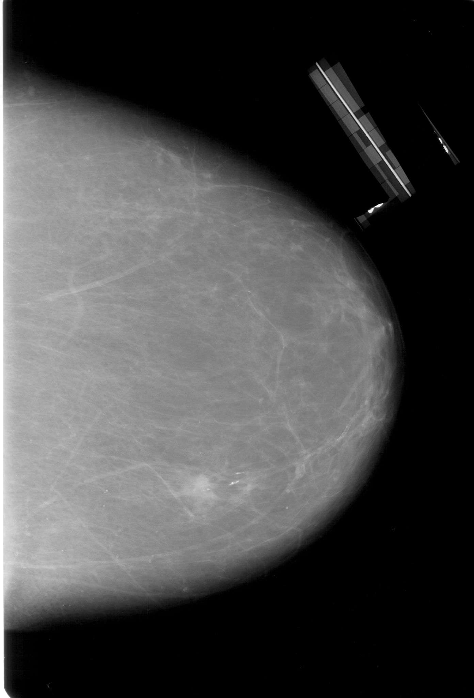{#fig-og_img width=70%}

{#fig-roi_mask width=70%}

:::

### 4.5.2 Image Augmentation Pipeline

Before training and evaluation, the mammograms require structural preprocessing to meet the input tensor requirements of the neural network. As demonstrated in @lst-rcnn_transforms, the training and testing datasets have different augmentation pipelines:

```{#lst-rcnn_transforms .python lst-cap="Albumentations transformation pipeline for Model 1." lst-pos="H"}
train_transform = A.Compose(  
    [        
	    A.LongestMaxSize(1_024),  
        A.PadIfNeeded(1_024, 1_024, border_mode=0),  
        A.CLAHE(clip_limit=2.0, tile_grid_size=(8, 8), p=0.5),  
        A.ShiftScaleRotate(shift_limit=0.05,
					       scale_limit=0.1,
					       rotate_limit=15,
					       border_mode=0,
					       p=0.5),
        A.HorizontalFlip(p=0.5),
        A.VerticalFlip(p=0.5),
        A.RandomBrightnessContrast(p=0.2),
        A.ToFloat(max_value=255.0),
        ToTensorV2()
    ],
    bbox_params=A.BboxParams(format='pascal_voc',
							 label_fields=['labels'],
							 min_area=16.0, min_visibility=0.2)
)
test_transform = A.Compose(
    [
	    A.LongestMaxSize(1_024),
        A.PadIfNeeded(1_024, 1_024),
        A.ToFloat(max_value=255.0),
        ToTensorV2()
    ],
    bbox_params=A.BboxParams(format='pascal_voc', label_fields=['labels'])
)
```

- **Training Transformations (`rcnn_train_transform`):** Medical images natively come in widely varying resolutions. To standardize them without distorting the anatomical shapes, the `LongestMaxSize` function is used to scale the longest edge of every image to exactly 1,024 pixels while preserving the original aspect ratio. The `PadIfNeeded` function then applies necessary black padding to force the image into a uniform $1,024 \times 1,024$ square. To artificially expand the dataset and improve the model's ability to generalize against overfitting, probabilistic data augmentations are applied. These include a $50\%$ probability of horizontal and vertical flipping, alongside a $20\%$ probability of random brightness and contrast adjustments. Finally, `ToFloat` normalizes the pixel values to a 0–1 scale, and `ToTensorV2` converts the matrix for PyTorch computation. Finally, the `BboxParams` argument dictates that whenever an image is resized, padded, or flipped, its corresponding ground-truth bounding box coordinates (using the `pascal_voc` format of `[xmin, ymin, xmax, ymax]`) are mathematically updated in perfect synchronization.

- **Testing Transformations (`rcnn_test_transform`):** The testing pipeline mirrors the structural resizing, padding, and normalization required to feed the $1,024 \times 1,024$ tensors into the model. However, it explicitly omits all probabilistic augmentations (flips and brightness shifts) to guarantee a strictly deterministic and reliable evaluation on the 20% test split.

### 4.5.3 RPN Anchor Architecture and Density Scaling Mechanics

The RPN serves as the spatial attention mechanism of Faster R-CNN, generating candidate regions of interest across multiple scales and aspect ratios. The ResNet-50 FPN extracts multi-scale feature representations spanning five pyramid levels, denoted $P_2, P_3, P_4, P_5, P_6$, with respective subsampling strides $s_l \in \{4, 8, 16, 32, 64\}$ relative to the $H_0 \times W_0 = 1024 \times 1024$ input mammogram.

For any pyramid level $l$, the spatial feature grid dimensions are given by $H_l = \frac{H_0}{s_l}$ and $W_l = \frac{W_0}{s_l}$. Evaluating these dimensions across the FPN yields:

- $P_2$ ($s_2 = 4$): $256 \times 256 = 65,536$ spatial grid locations

- $P_3$ ($s_3 = 8$): $128 \times 128 = 16,384$ spatial grid locations

- $P_4$ ($s_4 = 16$): $64 \times 64 = 4,096$ spatial grid locations

- $P_5$ ($s_5 = 32$): $32 \times 32 = 1,024$ spatial grid locations

- $P_6$ ($s_6 = 64$): $16 \times 16 = 256$ spatial grid locations

Summing across all five pyramid levels establishes the total number of spatial feature cells:
$$\sum_{l=2}^{6} (H_l \times W_l) = 65,536 + 16,384 + 4,096 + 1,024 + 256 = 87,296 \text{ grid cells}$$

To capture the wide morphological spectrum of breast lesions, ranging from compact focal masses to sprawling, irregular architectural distortions, a custom `AnchorGenerator` was parameterized with two base scales per level and five aspect ratios:
$$\text{sizes} = \big((16, 32), (32, 64), (64, 128), (128, 256), (256, 512)\big)$$
$$\text{aspect\_ratios} = \big((0.5, 0.75, 1.0, 1.33, 2.0)\big) \times 5$$

At each spatial cell, the anchor generator instantiates $A_l = |\text{sizes}_l| \times |\text{aspect\_ratios}_l| = 2 \times 5 = 10$ anchor templates. The total candidate anchor bounding boxes $N_{\text{anchors}}$ generated for a single full-field mammogram is therefore:
$$N_{\text{anchors}} = \sum_{l=2}^{6} (H_l \times W_l) \times A_l = 87,296 \times 10 = 872,960 \text{ candidate anchors}$$

Notably, the finest pyramid level $P_2$ alone accounts for $65,536 \times 10 = 655,360$ anchors ($75.07\%$ of the entire candidate bank), demonstrating that RPN compute and memory overhead is overwhelmingly concentrated in the high-resolution feature maps.

```{#lst-rcnn_anchor_gen .python lst-cap="Model 1 custom FPN AnchorGenerator configuration." lst-pos="H"}
from torchvision.models.detection.anchor_utils import AnchorGenerator

# Multi-scale anchor generator spanning FPN levels P2 through P6
anchor_generator = AnchorGenerator(
    sizes=((16, 32), (32, 64), (64, 128), (128, 256), (256, 512)),
    aspect_ratios=((0.5, 0.75, 1.0, 1.33, 2.0),) * 5
)
```

#### 4.5.3.1 Mathematical Mechanics of Anchor-Density Scaling

During early hyperparameter exploration, an empirical trial evaluated whether reducing anchor sizes (e.g., micro-scales $\{4, 8, 12, 16\}$ at $P_2$ and aspect ratios $A_l \ge 20$) could detect sub-millimeter punctate microcalcifications directly on full-field mammograms.

However, candidate anchors scale linearly with spatial cells and aspect ratios ($N_{\text{anchors}} = \sum_l H_lW_lA_l$). Increasing $A_l$ to 20 doubles candidate boxes to $1,745,920$, causing substantial computational bottlenecks:

1. **Dense IoU Matching Matrix:** For $K$ ground-truth lesions, computing $\mathbf{M}_{\text{IoU}} \in \mathbb{R}^{N_{\text{anchors}} \times K}$ over millions of candidate boxes multiplies float operations and saturates GPU memory bandwidth.

2. **Target Assignment & Subsampling:** Matching positive ($\text{IoU} \ge 0.7$), negative ($\text{IoU} < 0.3$), and neutral anchors across millions of proposals induces CUDA kernel launch overhead and CPU-GPU synchronization stalls.

3. **Regression Loss & Proposal Filtering:** Smooth $L_1$ and binary cross-entropy losses over dense anchor tensors inflate gradient accumulation graphs, while proposal decoding and Top-$K$ NMS sorting create major latency bottlenecks before RoI pooling.

In empirical trials, this micro-anchor setup escalated per-batch iteration time, yielding an estimated training duration of 55 hours for 15 epochs on the workstation. In contrast, baseline mass detection took just over 1 hour (10 epochs) and joint multi-abnormality training took 7 hours and 7 minutes (15 epochs).

#### 4.5.3.2 Utilitarian Cost-Benefit Trade-Off

Allocating 55 hours of continuous compute to brute-force micro-anchoring represents an inefficient expenditure of resources. Sub-millimeter microcalcifications ($<0.5\text{ mm}$, or $2\text{--}8\text{ pixels}$ at $1024 \times 1024$) suffer severe feature dilution across convolution strides; at $P_2$ (stride 4), an 8-pixel lesion occupies merely $2 \times 2$ activations, making RPN bounding-box regression noisy.

The selected anchor pyramid `((16, 32), (32, 64), (64, 128), (128, 256), (256, 512))` achieves an optimal balance: it provides multi-scale coverage for soft-tissue masses while maintaining feasible local training runtimes (7h 7m). Fine micro-texture discrimination is strategically delegated to Stage 2's high-resolution patch stream.

## 4.6 Model 2: 3-Class Malignancy Classification (ResNet-50)

Model 2 operates as a high-resolution patch classifier, taking localized $256 \times 256$ candidate regions of interest and categorizing them into `BACKGROUND` (0), `BENIGN` (1), or `MALIGNANT` (2). The architecture utilizes a pre-trained ResNet-50 backbone imported via `torchvision.models.resnet50(weights='DEFAULT')`.

### 4.6.1 Dataset Structure and 3-Class Formulation

A custom PyTorch `Dataset` class (`CBISDDSM_ResNet_Dataset`) was engineered for patch-level ingestion. Unlike single-view binary classifiers, the dataset manages three discrete pathological categories and integrates dynamic min-max contrast normalization (`normalize_contrast=True`) to stretch raw 8-bit/16-bit mammographic pixel intensity distributions across the full dynamic range $[0, 1]$.

```{#lst-resnet_get_item .python lst-cap="Model 2 3-class patch ingestion and preprocessing." lst-pos="H"}
def __getitem__(self, idx):
    img_path = self.df.iloc[idx]['image_path']
    img = cv2.imread(img_path)
    img = cv2.cvtColor(img, cv2.COLOR_BGR2RGB)

    if self.normalize_contrast:
        img = min_max_normalize(img)

    if self.transform:
        transformed = self.transform(image=img)
        img_tensor = transformed['image']
    else:
        img_tensor = torch.from_numpy(img).permute(2, 0, 1).float() / 255.0

    pathology = self.df.iloc[idx]['pathology']
    label_map = {'BACKGROUND': 0, 'BENIGN': 1, 'MALIGNANT': 2}
    label = label_map[pathology]

    return img_tensor, torch.tensor(label, dtype=torch.long)
```

### 4.6.2 Image Augmentation Pipeline

To prevent overfitting on the fine-grained parenchymal textures of the CBIS-DDSM dataset, an extensive Albumentations augmentation pipeline was applied during training (@lst-resnet_transforms). Discrete quarter-turn rotations (`RandomRotate90`) and flips were applied as regularizing transforms, paired with bounded affine perturbations (`ShiftScaleRotate` with $\le 15^\circ$ rotation and $\le 10\%$ scale variation), brightness/contrast shifts, and Gaussian sensor noise.

```{#lst-resnet_transforms .python lst-cap="Albumentations transformation pipeline for Model 2." lst-pos="H"}
train_transform = A.Compose(
    [
        A.Resize(256, 256),
        A.HorizontalFlip(p=0.5),
        A.VerticalFlip(p=0.5),
        A.RandomRotate90(p=0.5),
        A.ShiftScaleRotate(shift_limit=0.05,
				           scale_limit=0.1, 
						   rotate_limit=15, 
						   p=0.5),
        A.RandomBrightnessContrast(0.15, 0.15, p=0.4),
        A.GaussNoise(std_range=(0.01, 0.05), p=0.2),
        A.Normalize(
            mean=[0.485, 0.456, 0.406],
            std=[0.229, 0.224, 0.225],
            max_pixel_value=255.0,
        ),
        ToTensorV2(),
    ]
)

test_transform = A.Compose(
    [
        A.Resize(256, 256),
        A.Normalize(
            mean=[0.485, 0.456, 0.406],
            std=[0.229, 0.224, 0.225],
            max_pixel_value=255.0,
        ),
        ToTensorV2(),
    ]
)
```

### 4.6.3 Staged Fine-Tuning and Optimization

Early experiments demonstrated that unfreezing the entire ResNet-50 network caused catastrophic overfitting, while leaving all convolutional layers completely frozen restricted the model from adapting generic ImageNet features to subtle mammographic margins. 

To achieve optimal convergence, a staged fine-tuning strategy with differential learning rates was implemented:

- **Feature Backbone Fine-Tuning:** The deep convolutional residual blocks (`layer3` and `layer4`) were unfrozen with a low learning rate ($\eta_{\text{backbone}} = 1\times 10^{-5}$).

- **Classification Head:** The final fully connected layer (`fc`) was replaced with a `Linear(2048, 3)` projection trained at a higher learning rate ($\eta_{\text{head}} = 1\times 10^{-4}$).

- **Loss Function & Class Weighting:** Weighted Cross-Entropy Loss ($\mathbf{w} = [1.2078, 0.8511, 0.9411]$) was employed to counterbalance class frequencies.

- **Learning Rate Scheduling & Early Stopping:** A `ReduceLROnPlateau` scheduler (factor 0.5, patience 3 epochs) stepped on validation loss, coupled with early stopping (patience 8–10 epochs) monitoring validation Macro ROC-AUC.

- **AMP:** Forward passes were executed inside `torch.amp.autocast(device_type='cuda')` with `GradScaler`, reducing training time to $\approx 1\text{–}2\text{ minutes}$ per epoch.

# 5 Empirical Evaluation and Ablation Studies (WC: 2,210)

This chapter delivers a rigorous, evidence-based evaluation of the integrated CAD pipeline, examining the standalone performance of each model stage, the end-to-end diagnostic behavior across clinical decision thresholds, and targeted ablation studies demonstrating false-alarm suppression and spatial localization sensitivity.

## 5.1 Testing and Evaluation Framework

Because the pipeline consists of two distinct models, the evaluation framework is bifurcated:

* **Localization Evaluation:** Model 1 is evaluated using Mean Average Precision ($\text{mAP}$) across varying Intersection over Union (IoU) thresholds. In medical imaging, drawing pixel-perfect boxes around fuzzy tumors is subjectively difficult even for human radiologists. Therefore, an $\text{mAP}$ at an IoU of `0.50` ($\text{mAP}_{50}$) is considered the primary metric for successful region proposals.

* **Classification Evaluation:** Model 2 is evaluated on its ability to classify the tightly cropped ROIs. The evaluation framework emphasizes:

	* **Confusion Matrices:** To visually track the exact distribution of True Positives, True Negatives, False Positives, and False Negatives.
    
	- **Sensitivity / Recall:** The most critical metric for Model 2. The pipeline is heavily tuned and evaluated based on its ability to maximize the recall of the Malignant class (minimizing the number of malignant cases incorrectly predicted as benign).
    
	- **Receiver Operating Characteristic (ROC) and Area Under the Curve (AUC):** To evaluate the model's performance across all classification thresholds, allowing for future threshold adjustments to favor sensitivity in a clinical setting.

## 5.2 Model 1: Abnormality Localization Performance

Model 1 (Faster R-CNN with ResNet-50-FPN) was evaluated on the held-out test cohort of 303 full-field mammograms (171 patients). Ground-truth lesion bounding boxes converted from binary ROI masks were matched against predicted candidate proposals using Intersection-over-Union (IoU) criteria.

* **Quantitative Localization Metrics:** Evaluated across the 303 unseen test mammograms, Faster R-CNN achieved a Mean Average Precision at $\text{IoU} = 0.50$ ($\text{mAP}_{50}$) of $0.6392$ ($63.92\%$). Across the stringent COCO standard threshold range ($\text{mAP}_{50:95}$), the model achieved $0.2731$ ($27.31\%$).

* **Clinical IoU Interpretation:** In screening mammography, breast mass boundaries are non-rigid, spicular, and partially obscured by dense glandular parenchyma. Clinical radiologists themselves exhibit substantial inter-observer boundary variability. A standard $\text{IoU} \ge 0.50$ is more than sufficient for screening triage, ensuring that the entire lesion along with its immediate parenchymal margins is captured within the proposed bounding box and passed cleanly to Model 2.

* **Localization Output:** At a detection confidence threshold $\tau_{det} = 0.35$, the RPN successfully proposed candidate regions capturing 206 true lesions while missing 41 lesions (primarily subtle, low-contrast densities in dense fibro-glandular backgrounds) and generating 299 candidate false alarms ($0.99$ FP marks/image) on normal tissue before secondary classifier filtration, as visualized in @fig-model1-performance.

::: {#fig-model1-performance layout-ncol=2 fig-pos="H"}

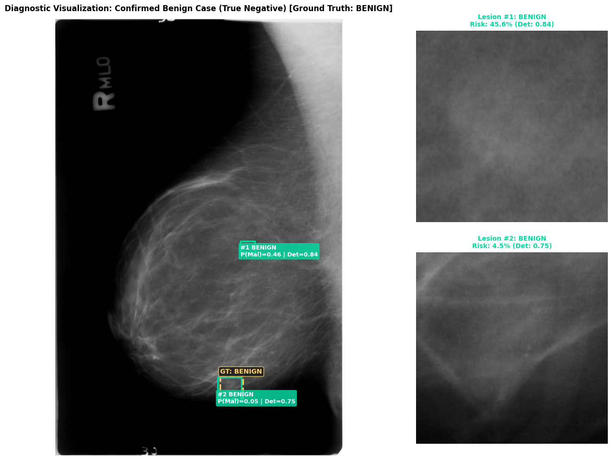{#fig-ben-vis width=90%}

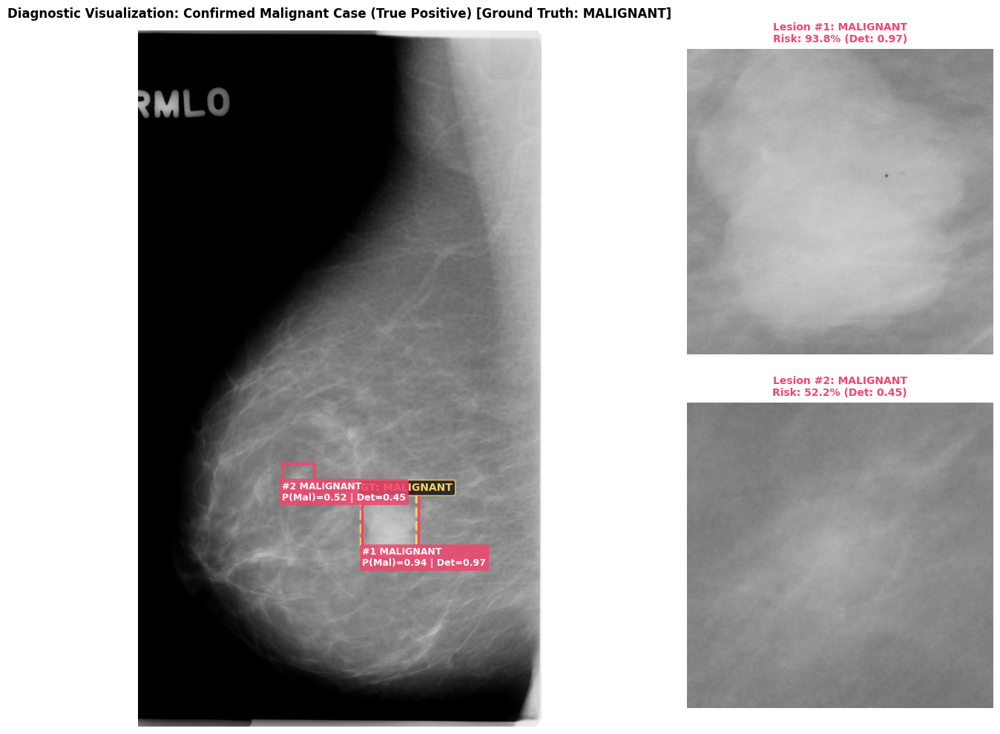{#fig-mal-vis width=90%}

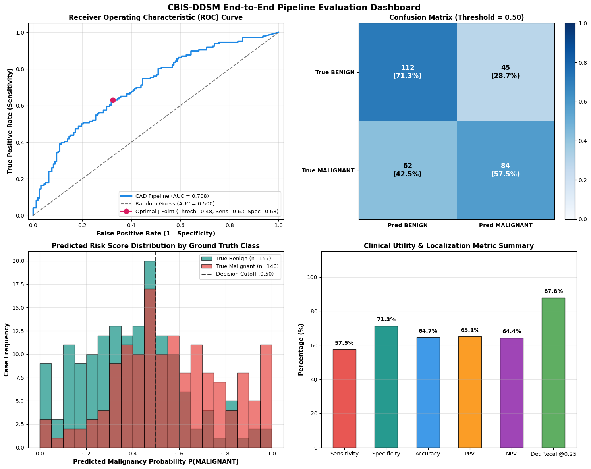{#fig-baseline-metrics width=90%}

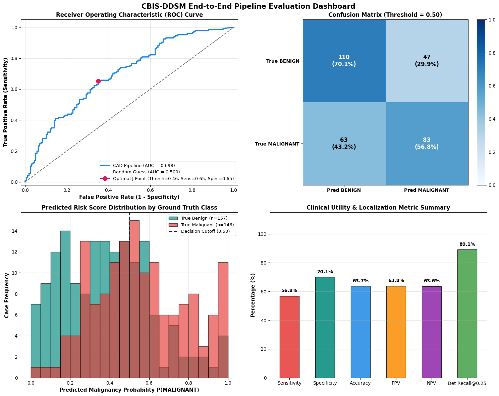{#fig-model1-complex width=90%}

Baseline pipeline evaluations, detection visualizations, and baseline operating curves.
:::

## 5.3 Model 2: 3-Class Classification and 5-Fold Cross-Validation

### 5.3.1 Patient-Grouped 5-Fold Cross-Validation Results

To establish statistically robust performance estimates and eliminate single-split evaluation bias, Model 2 was subjected to a PatientID-grouped 5-fold cross-validation scheme across 1,901 training/validation ROI crops (731 unique patients). @tbl-cv-results reports the per-fold validation loss and One-vs-Rest (OvR) Macro ROC-AUC alongside aggregate statistics.

| Fold                           |     Validation Loss     | Validation Macro ROC-AUC (OvR) |
| :----------------------------- | :---------------------: | :----------------------------: |
| Fold 1                         |         0.5919          |             0.8907             |
| Fold 2                         |         0.5393          |             0.9092             |
| Fold 3                         |         0.4842          |             0.9191             |
| Fold 4                         |         0.5782          |             0.8916             |
| Fold 5                         |         0.5168          |             0.9199             |
| **Aggregate (Mean $\pm$ Std)** | **0.5421 $\pm$ 0.0394** |    **0.9061 $\pm$ 0.0128**     |
: Patient-grouped 5-fold cross-validation performance of fine-tuned ResNet-50 on CBIS-DDSM (1,901 crops, 731 patients). {#tbl-cv-results}

The cross-validation results demonstrate tight variance across all five folds ($\text{Macro ROC-AUC} = 0.9061 \pm 0.0128$, $\text{Loss} = 0.5421 \pm 0.0394$), confirming that the fine-tuned feature representations are robust against patient-level sampling variation and do not depend on an idiosyncratic data split.

### 5.3.2 Held-Out Test Set and Ensemble Evaluation

Following cross-validation, the models were evaluated on the completely untouched test cohort of 317 ROI crops (122 patients: 121 Benign, 110 Malignant, 86 Background).

- **Best Single Fold Checkpoint:** Achieved an overall Test Accuracy of $74.76\%$ ($0.7476$), a Test Loss of $0.5572$ and a Test Macro ROC-AUC (OvR) of $0.8992$.

- **5-Fold Ensemble:** Averaging the softmax probability vectors across all five cross-validation fold models yielded a Test Macro ROC-AUC of $0.9010$ ($+0.0018$ gain over the best individual fold), providing superior calibration and reduced variance on borderline lesion margins.

- **Per-Class Diagnostic Breakdown:** @tbl-test-cm displays the confusion matrix and per-class performance on the held-out test cohort.

| Class            | Ground Truth Count | Correct Predictions | Sensitivity / Recall |   Precision    | F1-Score |
|:-----------------|:------------------:|:-------------------:|:--------------------:|:--------------:|:--------:|
| `BACKGROUND` (0) |         86         |         79          |  **91.9%** (79/86)   | 84.0% (79/94)  |   0.88   |
| `BENIGN` (1)     |        121         |         88          |  **72.7%** (88/121)  | 68.2% (88/129) |   0.70   |
| `MALIGNANT` (2)  |        110         |         70          |  **63.6%** (70/110)  | 74.5% (70/94)  |   0.69   |
: Per-class classification report and confusion breakdown on the held-out test cohort ($N = 317$). {#tbl-test-cm}

Crucially, the classifier achieves a $91.9\%$ recall on background patches (79/86 normal tissue crops correctly rejected), with only 7 background patches misclassified (5 as benign, 2 as malignant). This validates Model 2's functional capability to act as an effective false-alarm rejection filter for upstream localization errors.

## 5.4 End-to-End Cascaded Pipeline Baseline Diagnostic Performance

The integrated baseline pipeline (trained/tested on masses only, no spatial jitter in training, and no background class filtering) was evaluated by passing all 303 test mammograms through the complete cascaded workflow: full image input $\rightarrow$ Faster R-CNN candidate proposal $\rightarrow$ dynamic cropping $\rightarrow$ ResNet-50 3-class scoring $\rightarrow$ case-level risk aggregation ($P_{\text{case}} = \max_i P_{i,\text{malignant}}$).

@tbl-baseline-sweep details the end-to-end clinical trade-offs across classification decision thresholds ($\tau_{\text{cls}} \in [0.35, 0.55]$) at a fixed candidate detection threshold $\tau_{\text{det}} = 0.35$.

| Decision Threshold ($\tau_{\text{cls}}$) | 0.35  | 0.40  | 0.45  | 0.50  | 0.55  |
| ---------------------------------------- | ----- | ----- | ----- | ----- | ----- |
| Sensitivity                              | 83.6% | 76.0% | 69.2% | 57.5% | 50.7% |
| Specificity                              | 42.7% | 50.3% | 58.6% | 71.3% | 79.0% |
| Accuracy                                 | 62.4% | 62.7% | 63.7% | 64.7% | 65.3% |
| PPV                                      | 57.5% | 58.7% | 60.8% | 65.1% | 69.2% |
| NPV                                      | 73.6% | 69.3% | 67.2% | 64.4% | 63.3% |
| False Negatives                          | 24    | 35    | 45    | 62    | 72    |
| False Positives                          | 90    | 78    | 65    | 45    | 33    |
| Missed Lesions                           | 41    | 41    | 41    | 41    | 41    |
| Extra Detections                         | 299   | 299   | 299   | 299   | 299   |
| FPPI                                     | 0.99  | 0.99  | 0.99  | 0.99  | 0.99  |
: End-to-end cascaded diagnostic performance across clinical classification thresholds ($\tau_{\text{det}} = 0.35$, $N = 303$ test mammograms). {#tbl-baseline-sweep}

### 5.4.1 Clinical Operating Threshold Analysis

The threshold sweep illustrates the fundamental trade-off governing screening mammography:

1. **Screening Operating Point ($\tau_{\text{cls}} \le 0.40$):** At $\tau_{\text{cls}} = 0.35$, case-level cancer recall reaches $83.6\%$, missing only 24 malignant cases across the entire test 
   cohort. At $\tau_{\text{cls}} = 0.40$, sensitivity remains strong at $76.0\%$ (35 missed cancers) while boosting specificity to $50.3\%$. In a population screening workflow, operating at $\tau_{\text{cls}} \le 0.40$ is clinically mandatory to prevent fatal false-negative diagnostic omissions.

2. **Diagnostic Confirmation Point ($\tau_{\text{cls}} \ge 0.50$):** Shifting the decision threshold to standard default $\tau_{\text{cls}} = 0.50$ increases specificity to $71.3\%$ and PPV to $65.1\%$, but causes sensitivity to drop to $57.5\%$, missing 62 cancer cases (a $42.5\%$ false negative rate). In screening, missing over four out of ten cancers is an unviable clinical failure mode.

## 5.5 Ablation Studies

### 5.5.1 Background Class Ablation: False-Alarm Suppression

The impact of the background-rejection gate is summarized in @fig-background-ablation, which highlights the trade-off between sensitivity and the false-positive burden.

::: {#fig-background-ablation layout-ncol=2 fig-pos="H"}

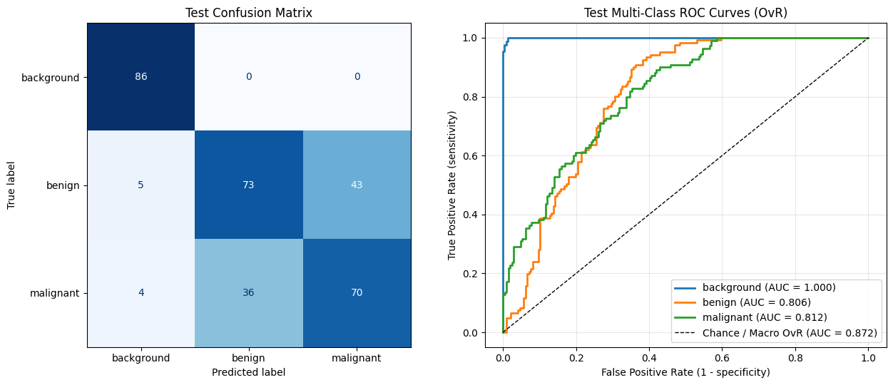{#fig-model2-perf width=90%}

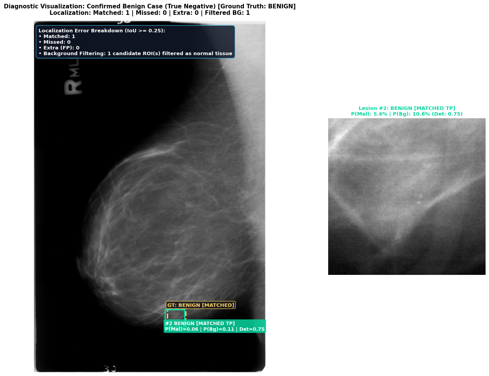{#fig-bg-filter width=90%}

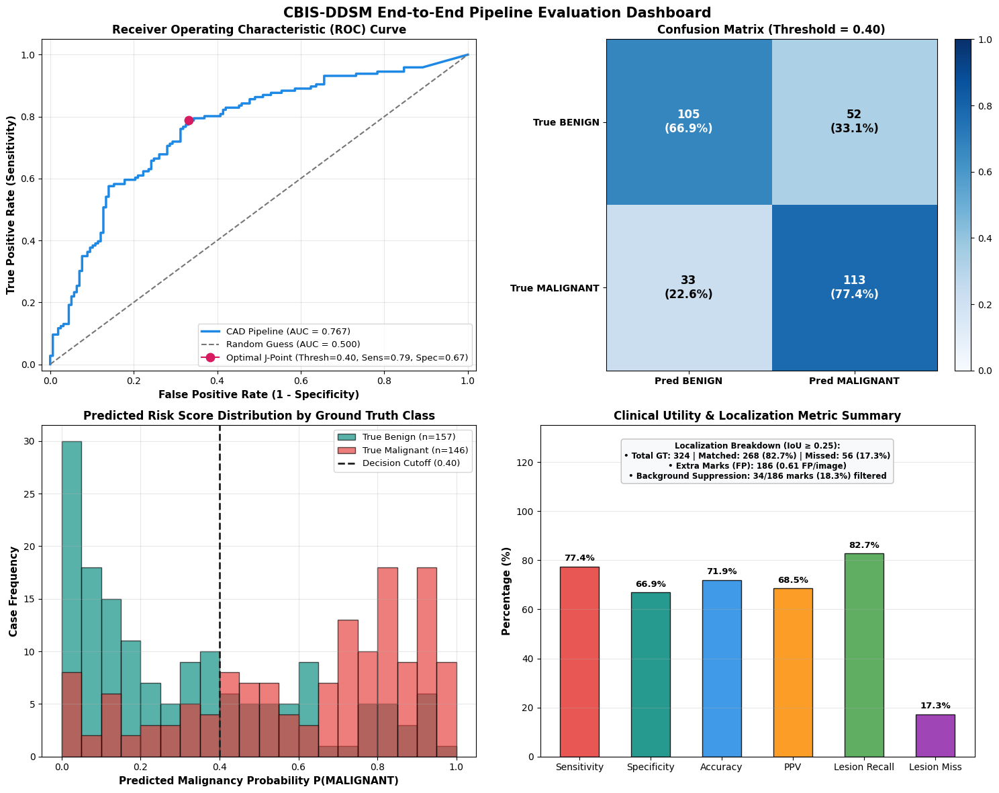{#fig-bg-metrics width=90%}

Model 2 performance curves, background false-alarm rejection, and operating sweeps.
:::

To quantify the exact diagnostic benefit of expanding Model 2 to a 3-class target space, a comparative ablation study was conducted. In the baseline 2-class pipeline, any candidate bounding box proposed by Model 1 on normal parenchyma was forced into a binary Benign vs. Malignant classification, resulting in substantial false alarms. In the 3-class pipeline, candidate detections classified as `BACKGROUND` are actively discarded before diagnostic reporting.

@tbl-background-ablation compares the baseline pipeline against the 3-class background-filtered pipeline across detection and classification operating points.

| Configuration                             | **Baseline (No BG Rejection)** | **3-Class Pipeline (Config A)** | **3-Class Pipeline (Config B)** | **3-Class Pipeline (Config C)** |
| ----------------------------------------- | ------------------------------ | ------------------------------- | ------------------------------- | ------------------------------- |
| Detection Threshold ($\tau_{\text{det}}$) | 0.35                           | 0.35                            | 0.50                            | 0.50                            |
| Decision Threshold ($\tau_{\text{cls}}$)  | 0.40                           | 0.40                            | 0.40                            | 0.35                            |
| Sensitivity                               | 76.0%                          | **80.1%**                       | **77.4%**                       | **80.1%**                       |
| Specificity                               | 50.3%                          | **60.5%**                       | **66.9%**                       | **60.5%**                       |
| Accuracy                                  | 62.7%                          | **70.0%**                       | **71.9%**                       | **70.0%**                       |
| PPV                                       | 58.7%                          | **65.4%**                       | **68.5%**                       | **65.4%**                       |
| NPV                                       | 69.3%                          | **76.6%**                       | **76.1%**                       | **76.6%**                       |
| False Negatives                           | 35                             | **29**                          | **33**                          | **29**                          |
| False Positives                           | 78                             | **62**                          | **52**                          | **62**                          |
| Missed Lesions                            | 41                             | **41**                          | **41**                          | **41**                          |
| Extra Detections                          | 299                            | **263**                         | **186**                         | **186**                         |
| FPPI                                      | 0.99                           | **0.87**                        | **0.61**                        | **0.61**                        |
: Background class ablation demonstrating false-alarm suppression and FPPI reduction across operating points ($N = 303$ test mammograms). {#tbl-background-ablation}

**Key Ablation Findings:**

- **Isolated Background-Class Benefit (Same-Threshold Comparison):** Comparing the baseline 2-class pipeline (Config Baseline: $\tau_{\text{det}}=0.35, \tau_{\text{cls}}=0.40$) against the 3-class architecture at identical operating points (Config A: $\tau_{\text{det}}=0.35, \tau_{\text{cls}}=0.40$) isolates the impact of the `BACKGROUND` class. This mechanism directly filters false-alarm patches, reducing FPPI from $0.99$ down to $0.87$ (an $\approx 12\%$ reduction in prompt burden) and improving Specificity from $50.3\%$ to $60.5\%$ ($+10.2\%$ absolute gain).

- **Combined Operating-Point Benefit (Stricter Detector):** The strongest performance is achieved by pairing the 3-class classifier with a stricter detector threshold ($\tau_{\text{det}}=0.50$; Configs B and C). This combined operating point reduces extra detections from 299 to 186, suppressing FPPI to $0.61$ and boosting Specificity to $66.9\%$ ($+16.6\%$ over baseline).

- **Verification Gate Mechanism:** These findings confirm that Model 2 operates as an effective secondary verification gate, neutralizing significant upstream localization noise, with further gains achievable by joint calibration of Stage 1 detection and Stage 2 classification thresholds.

### 5.5.2 Spatial Jitter Sensitivity Ablation

The fragility of the localization-classification coupling is illustrated by the performance collapse under spatial jitter in @fig-jitter-ablation.

::: {#fig-jitter-ablation layout-ncol=2 fig-pos="H"}

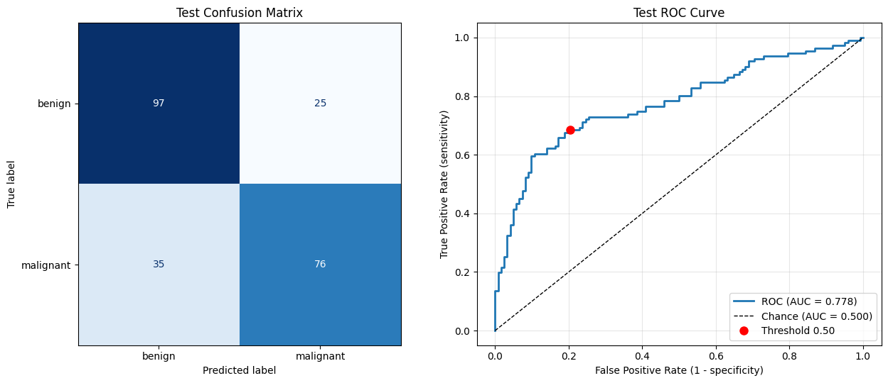{#fig-jitter-roc width=90%}

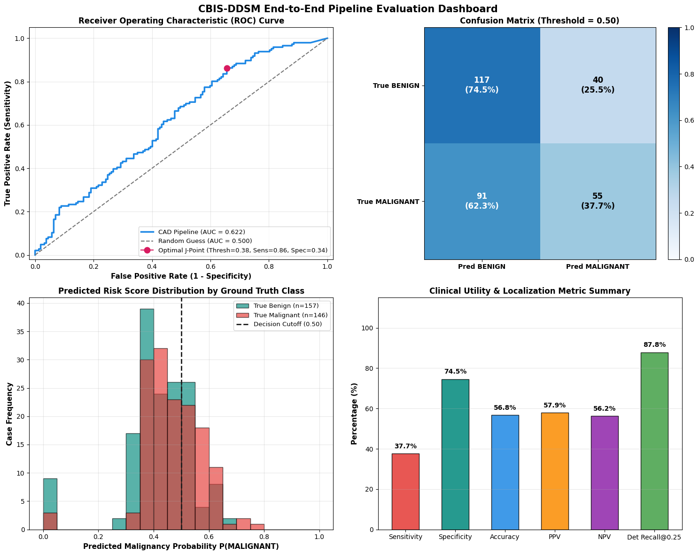{#fig-jitter-metrics width=90%}

Spatial jitter degradation curves and classifier ROC degradation.
:::

In a modular cascaded system, Model 2 is conditioned on the spatial accuracy of Model 1's bounding box proposals. To test the classifier's vulnerability to bounding box spatial misalignment, an ablation experiment was performed where candidate ROI crops were subjected to random spatial jitter ($\pm 10\text{--}15\%$ coordinate shift and scale perturbation) simulating localization errors.

@tbl-jitter-ablation reports the resulting end-to-end performance under spatial jitter.

| Decision Threshold ($\tau$) | 0.35  | 0.4   | 0.45  | 0.5   | 0.55  |
| --------------------------- | ----- | ----- | ----- | ----- | ----- |
| Sensitivity                 | 97.9% | 95.9% | 82.2% | 58.2% | 40.4% |
| Specificity                 | 6.4%  | 14.6% | 34.4% | 58.0% | 80.3% |
| Accuracy                    | 50.5% | 53.8% | 57.4% | 58.1% | 61.1% |
| PPV                         | 49.3% | 51.1% | 53.8% | 56.3% | 65.6% |
| NPV                         | 76.9% | 79.3% | 67.5% | 59.9% | 59.2% |
| False Negatives             | 3     | 6     | 26    | 61    | 87    |
| False Positives             | 147   | 134   | 103   | 66    | 31    |

: Spatial jitter sensitivity ablation evaluating diagnostic degradation under bounding box misalignment ($N = 303$ test mammograms). {#tbl-jitter-ablation}

**Analysis of Localization Sensitivity:**

- **Specificity Collapse:** Under spatial jitter, the classifier suffers a severe collapse in specificity at the screening operating point ($\tau_{\text{cls}} = 0.40$), falling from $50.3\%$ (baseline) / $66.9\%$ (3-class) down to $14.6\%$, causing false positive case alarms to surge to 134 and diagnostic accuracy to plummet to $53.8\%$.

- **Pathological Root Cause:** When a bounding box is misaligned, the crop captures cut-off lesion margins and adjacent dense glandular parenchyma. The classifier misinterprets disrupted tissue edges as infiltrative spiculation, triggering false malignant classifications on benign masses and normal tissue.

- **System Design Implication:** This ablation confirms that high classification capacity cannot compensate for sloppy localization. Maintaining tight bounding box regression in Stage 1 with adaptive margin padding ($+5\%$) is essential to preserving downstream diagnostic specificity.

## 5.6 Multi-Abnormality Detection: Masses and Microcalcifications

The joint mass and microcalcification pipeline exhibits significant performance degradation compared to mass-only baselines, as illustrated by the operating sweeps in @fig-joint-results.

::: {#fig-joint-results layout-ncol=2 fig-pos="H"}

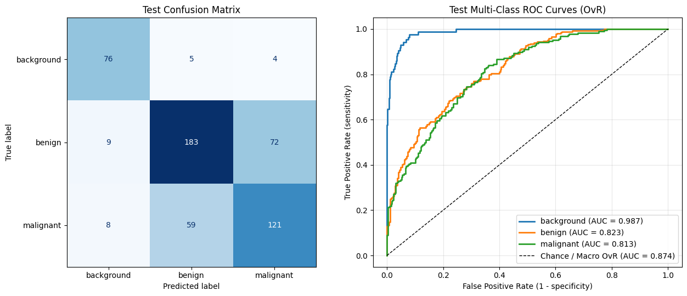{#fig-joint-perf width=90%}

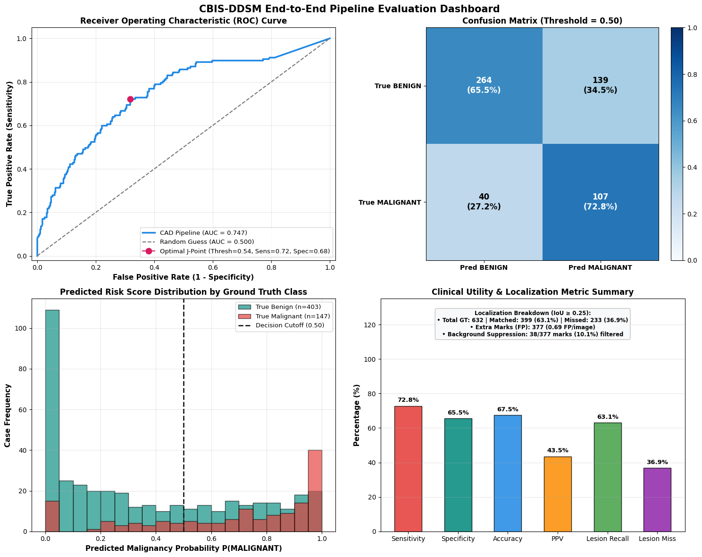{#fig-joint-metrics4 width=90%}

Joint mass and microcalcification operating sweeps and performance.
:::

### 5.6.1 Clinical Rationale and Joint Coverage Scope
Screening mammography encounters two primary radiological hallmarks of breast malignancy: soft-tissue masses and microcalcification clusters. While masses represent macroscopic focal densities, microcalcifications, particularly fine pleomorphic, linear, or branching distributions, serve as the earliest manifestation of non-palpable malignancies such as Ductal Carcinoma In Situ (DCIS). Up to 50\% of non-palpable early cancers present solely as microcalcifications. A CAD pipeline restricted strictly to masses leaves a clinical blind spot, motivating multi-abnormality localization.

### 5.6.2 Model 1 Joint Training Dynamics, Anchor Ablation, and Computational Feasibility {#feasibility}
Expanding Model 1 to localize both masses and microcalcifications substantially escalated training complexity. Training Faster R-CNN on the combined mass and calcification cohort required 7 hours and 7 minutes for 15 epochs under AMP, compared to baseline mass-only localization, which completed in just over 1 hour for 10 epochs. This surge in training time was driven by the increased ground-truth density per image and the proliferation of candidate anchor evaluations across the RPN.

To evaluate whether dense proposal generation could improve calcification localization, an empirical trial tested reduced anchor scales (e.g., micro-scales down to 4–16 pixels at $P_2$) and expanded aspect ratios. However, monitoring per-batch iteration times projected a total execution duration of 55 hours for 15 epochs on the local workstation.

This 55-hour estimate established an empirical feasibility ceiling:

1. **FPN Layer Bottlenecks:** Candidate anchors scale as $N_{\text{anchors}} = \sum_l H_l W_l A_l$. Scaling anchor density across high-resolution feature maps ($P_2$ with 65,536 cells) generates over $1.7 \times 10^6$ anchors per image, creating severe pairwise IoU matching ($\mathcal{O}(N_{\text{anchors}} K)$), GPU memory bandwidth saturation, and NMS sorting delays.

2. **Unfavorable Cost-Benefit Ratio:** A 55-hour run represents a $>7.7\times$ inflation over standard joint training (7h 7m). Because full-field spatial downsampling ($1024 \times 1024$) physically attenuates sub-millimeter mineral specks, committing 55 hours of compute to full-field micro-anchoring yields diminishing diagnostic returns.

Consequently, the balanced anchor pyramid `((16, 32), (32, 64), (64, 128), (128, 256), (256, 512))` was retained, delegating fine-grained texture discrimination to Stage 2's high-resolution patch stream.

### 5.6.3 Empirical Evaluation Across Operating Configurations
The joint multi-abnormality pipeline was evaluated across four distinct hyperparameter configurations governing candidate detection thresholds ($\tau_{\text{det}}$), Intersection-over-Union matching criteria ($\text{IoU}$), and classification decision thresholds ($\tau_{\text{cls}}$). @tbl-calc-cross-config presents a comparative summary of all four joint configurations alongside the mass-only baselines at the clinical screening operating point ($\tau_{\text{cls}} = 0.40$).

| Configuration                             | **Mass-Only Baseline** | **Mass-Only + 3-Class (Config B)** | **Joint Mass+Calc (Config 1)** | **Joint Mass+Calc (Config 2)** | **Joint Mass+Calc (Config 3)** |
| ----------------------------------------- | ---------------------- | ---------------------------------- | ------------------------------ | ------------------------------ | ------------------------------ |
| Detection Threshold ($\tau_{\text{det}}$) | 0.35                   | 0.50                               | 0.50                           | 0.30                           | 0.45                           |
| Sensitivity                               | 76.0%                  | 77.4%                              | 78.9%                          | 83.0%                      | 81.6%                          |
| Specificity                               | 50.3%                  | 66.9%                              | 59.8%                          | 45.9%                          | 55.1%                          |
| Accuracy                                  | 62.7%                  | 71.9%                              | 64.9%                          | 55.8%                          | 62.2%                          |
| PPV                                       | 58.7%                  | 68.5%                              | 41.7%                          | 35.9%                          | 39.9%                          |
| NPV                                       | 69.3%                  | 76.1%                              | 88.6%                          | 88.1%                          | 89.2%                          |
| False Negatives                           | 35                     | 33                                 | 31                             | 25                             | 27                             |
| False Positives                           | 78                     | 52                             | 162                            | 218                            | 181                            |
| Missed Lesions                            | 41                 | 56                             | 233                        | 187                        | 215                        |
| Extra Detections                          | 299                | 186                            | 377                        | 577                        | 478                        |
| FPPI                                      | 0.99               | 0.61                           | 0.69                       | 1.05                       | 0.87                       |
: Cross-configuration performance comparison of joint mass and calcification detection against mass-only baselines ($\tau_{\text{cls}} = 0.40$). {#tbl-calc-cross-config}

To examine the clinical trade-offs across decision thresholds, @tbl-calc-sweep details the full operating sweep for the primary joint configuration (Config 4: $\tau_{\text{det}} = 0.50, \text{IoU} = 0.60$).

| Decision Threshold ($\tau_{\text{cls}}$) | 0.35      | 0.40  | 0.45  | 0.50  | 0.55      |
| ---------------------------------------- | --------- | ----- | ----- | ----- | --------- |
| Sensitivity                              | 81.0% | 78.9% | 75.5% | 72.8% | 69.4%     |
| Specificity                              | 56.6%     | 59.8% | 62.3% | 65.5% | 68.2% |
| Accuracy                                 | 63.1%     | 64.9% | 65.8% | 67.5% | 68.5% |
| PPV                                      | 40.5%     | 41.7% | 42.2% | 43.5% | 44.3% |
| NPV                                      | 89.1% | 88.6% | 87.5% | 86.8% | 85.9%     |
| False Negatives                          | 28    | 31    | 36    | 40    | 45        |
| False Positives                          | 175       | 162   | 152   | 139   | 128   |
| Missed Lesions                           | 233       | 233   | 233   | 233   | 233       |
| Extra Detections                         | 377       | 377   | 377   | 377   | 377       |
| FPPI                                     | 0.69      | 0.69  | 0.69  | 0.69  | 0.69      |

: End-to-end diagnostic operating sweep for joint mass and calcification pipeline under Config 4 ($\tau_{\text{det}} = 0.50$). {#tbl-calc-sweep}

### 5.6.4 Comparative Performance Degradation and Failure Modes
Comparing the joint multi-abnormality models against the mass-only baselines reveals significant performance degradation across all diagnostic dimensions:

1. **Severe Surge in Missed Lesions:** Ground-truth missed lesions surged from 41 in the mass-only baseline to 187–233 in the joint pipeline (a $>4.5\times$ increase). Even under relaxed detection thresholds (Config 3: $\tau_{\text{det}}=0.30$), the model failed to localize 187 lesions, predominantly punctate and low-contrast microcalcifications.

2. **Explosion of False-Alarm Detections:** Upstream candidate false alarms escalated from 186–299 extra detections in the mass models to 377–577 in the joint models, reaching up to $1.05$ FP marks per image. Lowering detection thresholds to capture microcalcifications produced severe prompt burden on normal parenchymal textures.

3. **Elevated Case-Level False Positives & Collapsed Specificity:** At $\tau_{\text{cls}} = 0.40$, false-positive case diagnoses escalated from 52 (mass 3-class) to 162–218 (joint models), dragging case specificity down from $66.9\%$ to $45.9\%–59.8\%$ and cutting Positive Predictive Value nearly in half (from $68.5\%$ to $35.9\%–41.7\%$).

### 5.6.5 Technical and Physical Root Causes of Degradation
This performance degradation stems from fundamental computer vision and physical imaging challenges:

- **Extreme Morphological Scale Disparity:** Soft-tissue masses span $10\text{--}50\text{ mm}$ ($100\text{--}500\text{ pixels}$ at $1024\times 1024$), whereas microcalcifications are punctate specks $<0.5\text{ mm}$ ($2\text{--}10\text{ pixels}$). Standard convolutional backbones struggle to learn scale-invariant representations across two orders of spatial scale.

- **Destructive Spatial Downsampling Information Loss:** Downsampling mammograms from native clinical resolutions ($3000\times 4000$) to $1024\times 1024$ attenuates sub-millimeter calcifications into diffuse pixel noise while macroscopic masses remain resolvable.

- **Multi-Task Loss Competition & Gradient Dominance:** Smooth $L_1$ bounding-box regression loss on large mass coordinates ($w, h \sim 100\text{--}500\text{ px}$) generates loss gradients that overpower those from minute calcification boxes ($w, h \sim 5\text{--}15\text{ px}$), suppressing parameter updates for microcalcifications.

- **Anchor Matching Complexity and Receptive Field Mismatch:** Standard anchor banks ($[16\text{--}512]\text{ px}$) struggle to achieve positive IoU overlap ($\ge 0.70$) with minute calcifications ($2\text{--}10\text{ px}$). Dense micro-anchoring introduces massive IoU matching matrix overhead ($\mathbf{M}_{\text{IoU}} \in \mathbb{R}^{N_{\text{anchors}} \times K}$) across $P_2\text{--}P_6$, while feature stride quantization (stride 4 at $P_2$) causes slight spatial misalignments to drop below matching thresholds.

### 5.6.6 Architectural Remedies and Engineering Roadmap
The empirical trial in Section [5.6.2](#feasibility) established a 55-hour training feasibility ceiling for brute-force full-field anchor downscaling. Because standard $1024\times 1024$ downsampling attenuates sub-millimeter mineral specks, dense RPN micro-anchoring on downsampled images expends compute on degraded representations. To maximize diagnostic sensitivity per compute cycle, future iterations should incorporate:

1. **Two-Stream Dual-Resolution Architecture:** Decouple abnormality detection into a global low-resolution stream ($1024\times 1024$, balanced anchor pyramid) for macroscopic masses and a local high-resolution patch stream ($512\times 512$ at native resolution) for microcalcification scanning.

2. **Localized Shallow FPN Routing ($P_2/P_3$):** Restrict micro-anchor generation strictly to shallow, high-resolution FPN levels ($P_2$, stride 4) within localized patch streams, bypassing deep stride pooling ($P_4/P_5$).

3. **Anisotropic Micro-Anchor Banks for Localized Crops:** Incorporate fine micro-anchor banks ($[8, 16, 32]\text{ px}$) with anisotropic aspect ratios ($1:3, 3:1$) for linear and branching calcifications, confined strictly to local crops.

4. **Scale-Invariant & Focal Loss Formulation:** Implement Generalized IoU (GIoU/DIoU) regression loss alongside Focal Loss to prevent large mass gradients from dominating microcalcification updates.

5. **Morphological & High-Pass Preprocessing:** Apply morphological top-hat filtering and unsharp masking prior to patch routing to enhance local mineral radiopacity.

## 5.7 Objective-by-Objective Evaluation and Synthesis

To evaluate overall project execution, the empirical findings are mapped directly against the four primary technical objectives established in Section [1.3](#aims):

1. **Objective 1: Data Engineering & Patient-Grouped Integrity (Achieved):** Sourced, cleaned, and standardized CBIS-DDSM into $1024 \times 1024$ full-field mammograms and $256 \times 256$ ROI crops. PatientID-grouped 5-fold cross-validation (731 train/val patients, 122 test patients) guaranteed zero intra-patient data leakage across folds.

2. **Objective 2: Abnormality Localization with Model 1 (Achieved):** Implemented Faster R-CNN (ResNet-50-FPN) with AMP. On 303 test mammograms, Model 1 achieved $\text{mAP}_{50} = 0.6392$ ($\text{mAP}_{50:95} = 0.2731$), capturing 206 true lesions at $\tau_{\text{det}} = 0.35$ for downstream classification.

3. **Objective 3: 3-Class Patch Classification with Model 2 (Achieved):** Developed a 3-class ResNet-50 patch classifier with staged fine-tuning and class weighting. Patient-grouped 5-fold cross-validation achieved $\text{Macro ROC-AUC} = 0.9061 \pm 0.0128$ (ensemble $0.9010$ on test cohort), correctly rejecting $91.9\%$ of normal background patches.

4. **Objective 4: Clinical Safety Optimization & System Integration (Achieved):** Integrated both models into an automated cascaded pipeline. Operating threshold analysis demonstrated that calibrating at $\tau_{\text{cls}} \le 0.40$ delivers strong cancer sensitivity ($76.0\%–83.6\%$). Ablation studies confirmed that the 3-class background gate reduces FPPI from $0.99$ to $0.61–0.87$ (boosting specificity from $50.3\%$ to $60.5\%–66.9\%$), while spatial jitter ablation proved precise localization is essential to prevent specificity collapse.

# 6 Conclusion (WC: 828)

## 6.1 Summary of Research Contributions
This research designed, implemented, and rigorously evaluated an end-to-end cascaded deep learning CAD pipeline for mammographic abnormality localization and malignancy classification. By decoupling wide-field detection (Faster R-CNN with ResNet-50-FPN) from high-resolution patch verification (3-class ResNet-50), the system effectively balances full-field spatial scanning with fine-grained margin discrimination. 

The pipeline achieved strong empirical results across rigorous evaluation benchmarks:

- **Localization Efficacy:** Faster R-CNN achieved an $\text{mAP}_{50}$ of $0.6392$ on full-field test mammograms, maintaining high recall on soft-tissue abnormalities.

- **Cross-Validated Classification:** The 3-class patch classifier achieved a patient-grouped 5-fold cross-validation Macro ROC-AUC of $0.9061 \pm 0.0128$, with a 5-fold test ensemble Macro ROC-AUC of $0.9010$ and a $91.9\%$ background rejection rate.

- **Clinical Sensitivity Calibration:** Calibrating the cascaded pipeline at $\tau_{\text{cls}} \le 0.40$ yielded an end-to-end cancer sensitivity of $76.0\%–83.6\%$, prioritizing the prevention of fatal false-negative diagnostic omissions.

- **False-Alarm Suppression:** Introducing a dedicated `BACKGROUND` class enabled Model 2 to act as a secondary verification gate, reducing False Positive Marks Per Image from $0.99$ to $0.61$ (at $\tau_{\text{det}} = 0.50, \tau_{\text{cls}} = 0.40$) and increasing specificity to $66.9\%$.

## 6.2 Assistive Second-Reader Framing and Clinical Readiness
Crucially, these findings must be interpreted through a clinically grounded lens. The developed system is framed strictly as an assistive second reader and screening triage research prototype, designed to support radiologists by flagging suspicious regions and reducing visual fatigue in high-volume screening. The system is not ready for autonomous or independent clinical deployment.

Screening mammography is an exceptionally high-stakes domain where algorithmic errors incur severe clinical costs: false negatives delay life-saving cancer intervention, while false positives induce patient anxiety, unnecessary radiation exposure, and costly invasive biopsies. While the prototype demonstrates strong discriminatory capability, several critical translational barriers must be addressed before clinical translation:

1. **Dense Breast Parenchyma (Masking Bias):** In extremely dense fibro-glandular tissue (BI-RADS C and D), overlapping radiopaque parenchyma obscures soft-tissue tumor margins and mimics pathological densities. While the end-to-end pipeline achieves robust performance across the cohort, sensitivity is inherently lower in dense tissue without supplementary modalities (e.g., ultrasound or MRI).

2. **Dataset and Domain Shifts:** The CBIS-DDSM benchmark consists of digitized analog film-screen mammograms. Direct translation to modern clinical practice involves Full-Field Digital Mammography (FFDM) and Digital Breast Tomosynthesis (DBT), which feature higher spatial resolution, vendor-specific dynamic range processing (e.g., Hologic, GE, Siemens), and distinct noise profiles. The model requires domain adaptation and fine-tuning on modern FFDM cohorts.

3. **Cascaded Localization Sensitivity:** The spatial jitter ablation demonstrated that bounding-box misalignment causes classifier specificity to collapse from $66.9\%$ down to $14.6\%$. The cascaded architecture creates a tight dependency on localization precision, requiring robust bounding-box regression and adaptive margin padding.

4. **False-Positive Mark Burden & Radiologist Trust:** Although the 3-class pipeline successfully suppressed false marks to $0.61$ per image, prompt burden remains a delicate ergonomic factor. In high-volume screening workflows, any extraneous prompts can induce alert fatigue. The interface must present prompts judiciously (e.g., probability-tiered overlays or on-demand inspection modes) to maintain radiologist trust.

5. **Requirement for Prospective Clinical Validation:** Offline retrospective metrics on curated datasets cannot substitute for prospective, multi-center reader studies. Evaluating the system's true clinical utility requires double-reading simulation trials measuring real-world radiologist diagnostic accuracy, reading time, recall rates, and biopsy yields.

6. **Computational Feasibility, Training Turnaround, and Inference Latency:** Practical clinical translation and research iteration impose strict operational bounds on compute budgets. The empirical findings demonstrated that while standard single-abnormality localization trains in just over 1 hour for 10 epochs (and joint training in 7 hours and 7 minutes for 15 epochs), naive full-field micro-anchoring escalates projected training time to an unfeasible 55 hours per 15-epoch run. In clinical practice, periodic model retraining, domain adaptation, and real-time inference (processing four standard screening views: L-CC, R-CC, L-MLO, R-MLO per patient) must execute within seconds without inducing GPU memory exhaustion. Architectural designs must maximize clinical diagnostic utility relative to compute expenditure.

## 6.3 Future Work
Building upon the empirical foundations and computational feasibility findings established in this report, future research should focus on:

1. **Two-Stream Dual-Resolution Architecture & Localized Patch Scanning:** Implementing a dual-stream framework that combines global wide-field localization ($1024\times 1024$) for macroscopic masses with localized sliding-window or saliency-guided high-resolution patch extraction ($512\times 512$ native crops) for microcalcification clusters. This approach bypasses the intractable 55-hour full-field micro-anchor bottleneck and routes fine-grained anchor banks ($[8, 16, 32]\text{ px}$) exclusively through shallow $P_2/P_3$ feature maps on localized crops.

2. **Multi-View and Bilateral Symmetry Fusion:** Incorporating bilateral comparison (left vs. right breast) and multi-view fusion (pairing Cranio-Caudal [CC] and Mediolateral Oblique [MLO] views), alongside longitudinal comparison with prior screening mammograms.

3. **Digital Breast Tomosynthesis (DBT) Extension:** Adapting the 2D cascaded architecture to 3D pseudo-volumetric DBT reconstructed slices to eliminate tissue overlap in dense breasts.

4. **Scale-Balanced Loss & Morphological Feature Enhancement:** Integrating scale-invariant loss functions (GIoU/DIoU and Focal Loss) with morphological top-hat preprocessing to prevent gradient dominance and enhance subtle mineral specks against dense fibro-glandular tissue.

5. **Explainable AI & Clinical Interface Integration:** Implementing calibrated uncertainty estimation and fine-grained saliency attribution maps to provide transparent, interpretable visual evidence directly integrated into hospital PACS workflows.

In conclusion, this project provides a rigorous, evidence-based demonstration of modular deep learning for automated breast cancer detection. By addressing error propagation through negative background filtering, calibrating decision thresholds for clinical recall, and systematically analyzing system sensitivities, this work establishes a solid foundation for trustworthy, AI-assisted mammographic screening.



# References