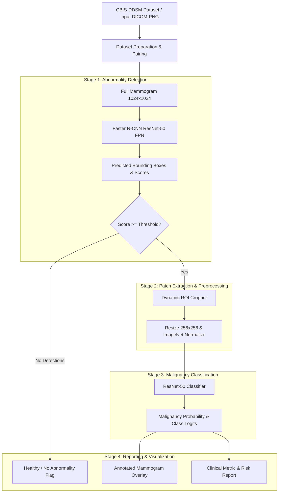

=== Clinical Operating Threshold Trade-off Analysis ===

| Decision Threshold ($\tau$_cls) | Sensitivity (Recall) | Specificity (TNR) | Diagnostic Accuracy | PPV (Precision) | NPV   | False Negatives (Missed) | False Positives | Missed Lesions | Extra Detections | FP Marks/Image | Clinical Objective            |
|--------------------------------:|:---------------------|:------------------|:--------------------|:----------------|:------|-------------------------:|----------------:|---------------:|-----------------:|---------------:|:------------------------------|
|                            0.35 | 83.6%                | 42.7%             | 62.4%               | 57.5%           | 73.6% |                       24 |              90 |             41 |              299 |           0.99 | High Sensitivity Screening    |
|                             0.4 | 76.0%                | 50.3%             | 62.7%               | 58.7%           | 69.3% |                       35 |              78 |             41 |              299 |           0.99 | High Sensitivity Screening    |
|                            0.45 | 69.2%                | 58.6%             | 63.7%               | 60.8%           | 67.2% |                       45 |              65 |             41 |              299 |           0.99 | Balanced Operating Point      |
|                             0.5 | 57.5%                | 71.3%             | 64.7%               | 65.1%           | 64.4% |                       62 |              45 |             41 |              299 |           0.99 | High Specificity Confirmation |
|                            0.55 | 50.7%                | 79.0%             | 65.3%               | 69.2%           | 63.3% |                       72 |              33 |             41 |              299 |           0.99 | High Specificity Confirmation |

### Architecture Diagram

~3hr runtime for model 1 for complex training